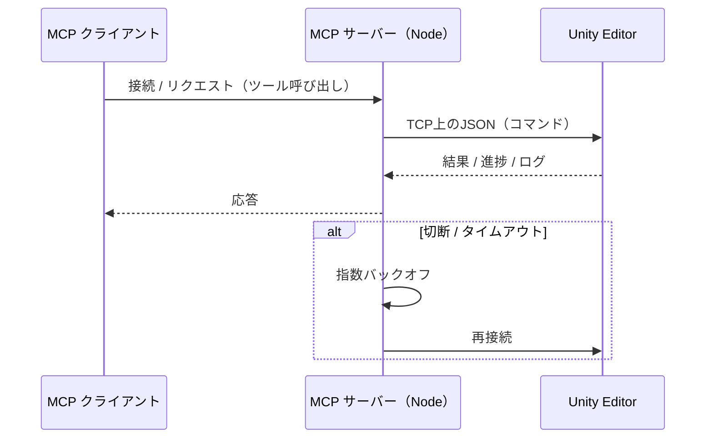
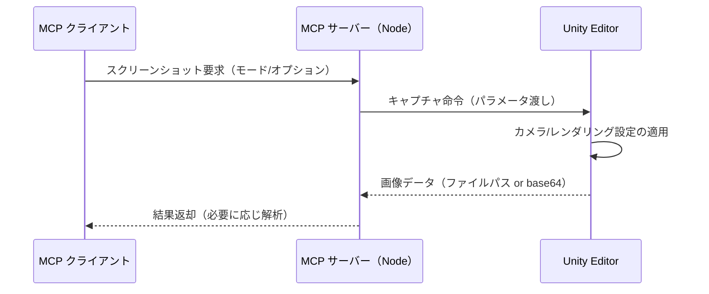
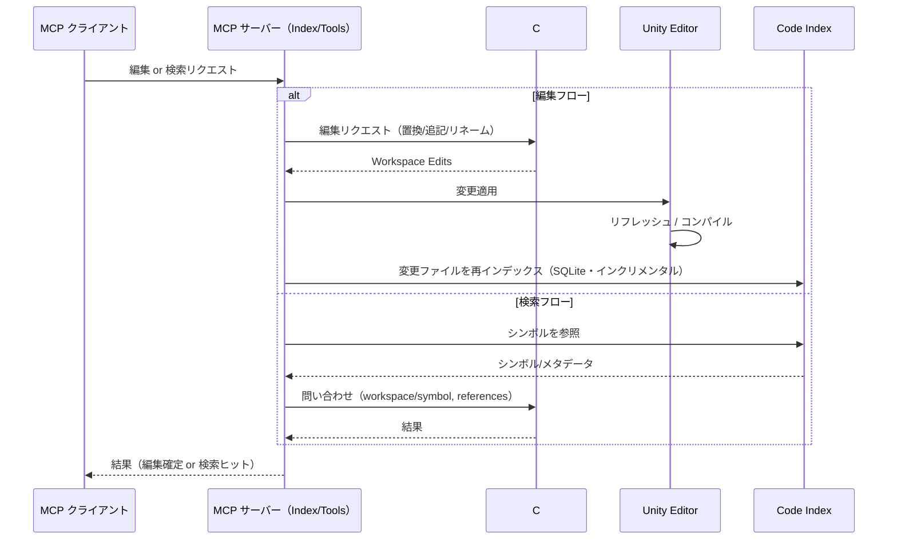

# Unity MCP Server

[English](README.md) | 日本語

## 概要

Unity MCP Server は、LLMクライアントからUnity Editorを自動化します。シンプルなインターフェースで、安全で再現性の高いエディタ操作を実現します。

### 機能仕様書

- **全機能**: [`specs/`](specs/) - SDD形式で15機能を文書化（Unity Test Execution含む）

### 開発プロセス

このプロジェクトは **Spec-Driven Development (SDD)** および **Test-Driven Development (TDD)** 手法に従っています：

- **開発憲章**: [`memory/constitution.md`](memory/constitution.md) - コア開発原則と要件
- **開発者ガイド**: [`CLAUDE.md`](CLAUDE.md) - ワークフロー、ガイドライン、Spec Kit統合
- **TDD**: Red-Green-Refactorサイクル強制; 実装前にテスト作成
- **テストカバレッジ**: ユニットテスト (80%以上), 統合テスト (クリティカルパス100%)

### セットアップ
Unity: Package Manager → git URL から追加 → `https://github.com/akiojin/unity-mcp-server.git?path=UnityMCPServer/Packages/unity-mcp-server`
MCPクライアント設定例 (Claude Desktop):
  - macOS: `~/Library/Application Support/Claude/claude_desktop_config.json`
  - Windows: `%APPDATA%\Claude\claude_desktop_config.json`
  - 追加例:
    ```json
    {
      "mcpServers": {
        "unity-mcp-server": {
          "command": "npx",
          "args": ["@akiojin/unity-mcp-server@latest"]
        }
      }
    }
    ```

### HTTPモード（HTTPのみ許可されたネットワーク向け）
```
npx @akiojin/unity-mcp-server --http 6401 --no-telemetry
curl http://localhost:6401/healthz
```
- `--http [port]` で HTTP リスナー起動（ヘルスチェック: `/healthz`）。
- `--no-telemetry` で外向き送信なしを明示（デフォルトoff）。
- `--no-stdio` で stdio を無効にし HTTP のみにもできる。
- Host ヘッダは `localhost` / `127.0.0.1` のみ許可（`UNITY_MCP_HTTP_ALLOWED_HOSTS` で変更可）。

### テレメトリポリシー
- 既定: off（送信なし）。
- 明示オン: `--telemetry` または `UNITY_MCP_TELEMETRY=on`。

### マルチインスタンス CLI
```
unity-mcp-server list-instances --ports=6400,6401 --host=localhost --json
unity-mcp-server set-active localhost:6401
```

### Unity エディタ GUI（非開発者向け）
- メニュー: `MCP Server / Start` でウィンドウを開き Start/Stop、HTTP/Telemetry トグルとポート設定。
- サンプル: 「Run Sample (Scene)」「Run Sample (Addressables)」で動作デモを実行。
- Play Mode中はボタンを無効化。Addressables未導入プロジェクトではサンプルがスキップされる旨を表示。

Spec Kitワークフロー (`/speckit.specify`, `/speckit.plan`, `/speckit.tasks`) も参照してください。

### Gitフック（Husky）

このプロジェクトでは [Husky](https://typicode.github.io/husky/) を使用して、Gitフックによるコード品質とコミットメッセージの標準化を強制しています：

- **commit-msg**: commitlintによる [Conventional Commits](https://www.conventionalcommits.org/) 形式の検証
- **pre-commit**: ステージされたファイルに対してESLint、Prettier、markdownlintを実行
- **pre-push**: リモートへのプッシュ前にテストスイートを実行
- **post-merge**: package.jsonの変更時に依存関係の更新が必要な旨を通知

#### フックのバイパス

緊急時には `--no-verify` でフックをスキップできます：

```bash
git commit --no-verify -m "emergency fix"
git push --no-verify
```

**注意**: 使用は最小限に留めてください。フックはコード品質の維持とCI失敗の防止のために存在します。

#### フック設定

- Commitlint: `.commitlintrc.json` (Conventional Commits規則)
- ESLint: `.eslintrc.json` (JavaScriptコードスタイル)
- Prettier: `.prettierrc.json` (コードフォーマット)
- Markdownlint: `.markdownlint.json` (Markdown規則)

詳細な開発ガイドラインは [CLAUDE.md](CLAUDE.md) を参照してください。

### Spec Kit（SDD）運用

- `.specify/` 配下に Spec Kit v0.0.78 のスクリプト・テンプレート・メモリが展開されています。
- `uvx --from git+https://github.com/github/spec-kit.git specify check` でCLIとテンプレートを最新化できます。
- フィーチャーIDは必ず `SPEC-[0-9a-f]{8}` 形式（例: `SPEC-1a2b3c4d`）とし、Gitブランチは作成しません。アクティブなIDは `.specify/.current-feature` に記録されます。
- テンプレートは日本語化済みです。更新は `/.specify/templates/*.md` を修正してください。
- 互換性のため既存の `scripts/` は `.specify/scripts/bash/` を呼び出すラッパーに置き換えています。

### C#編集の方針（重要）

- C# の探索/参照/構造化編集は、同梱の自己完結 C# LSP で行います（Unityとは通信しません）。
- `script_*` ツールは内部で LSP を呼び出すため、Unity のコンパイル/ドメインリロードの影響を受けにくくなっています。
- 危険な行単位置換（line-based patch / pattern置換）は廃止しました。

開発者向け情報

ソースからのビルドや開発環境のセットアップは `CONTRIBUTING.md` に記載しています。利用者は .NET のインストールは不要です。

LSP は MCP サーバが自動ダウンロード・自動更新（固定版）を行います。ユーザー側での .NET SDK の導入は不要です。

代表的な使い方（MCPツール）

- シンボル検索: `script_symbol_find { "name": "ClassName", "kind": "class" }`
- 参照検索: `script_refs_find { "name": "MethodName" }`
- メソッド本体置換（プリフライト→適用）:
  - `script_edit_structured { "operation": "replace_body", "path": "Packages/.../File.cs", "symbolName": "Class/Method", "newText": "{ /* ... */ }", "preview": true }`
  - エラーが無ければ `"preview": false` で適用
- 追記（クラス直後など）:
  - `script_edit_structured { "operation": "insert_after", "path": "...", "symbolName": "ClassName", "kind": "class", "newText": "\nprivate void X(){}\n", "preview": false }`
- 1〜2行のスニペット調整（ガード削除・条件変更など）:
  - `script_edit_snippet { "path": "Assets/Scripts/Foo.cs", "preview": true, "instructions": [{ "operation": "delete", "anchor": { "type": "text", "target": "        if (value == null) return;\n" } }] }`

必要時のみ、Unity側で手動 `AssetDatabase.Refresh` を行ってください。

パフォーマンス

- 既定で LSP を常駐起動し、初回以降の起動コストを回避します。

## LLM最適化の原則

- 応答を小さく: ページングと保守的な上限を有効にする。
- スニペット優先: 全文読み取りを避け、前後1–2行の短い文脈に限定。
- 厳密に絞る: `Assets/`/`Packages/` 配下、kind、exact などで絞り込み。
- サマリ活用: 可能なツール側の要約結果を信頼して利用。
- previewは必要時のみ: 安全であれば直接適用してトークン節約。
- 画像/動画は最小解像度・base64は即時解析時のみ。

推奨上限
- 検索: `pageSize≤20`、`maxBytes≤64KB`、`snippetContext=1–2`、`maxMatchesPerFile≤5`。
- ヒエラルキー: `nameOnly=true`、`maxObjects 100–500`（詳細が必要な場合は10–50）。
- script_read: 対象の前後30–40行、`maxBytes` を設定。
- 構造化編集: 応答は要約（errors≤30、message≤200文字、長文≤1000文字）。

## 安全な構造化編集プレイブック

1) シンボル特定: `script_symbols_get` または `script_symbol_find`（`kind`/`exact` 指定推奨）。
   - パスは `Assets/` または `Packages/` 起点のプロジェクト相対パスのみ使用。
   - 検索結果の container から `Outer/Nested/Member` のような `namePath` を組み立てる。
2) 最小限のコード確認: `script_read` で対象の前後30–40行。
3) 安全な編集:
   - `script_edit_snippet` は 80 文字以内の局所変更に使用（null ガード削除・条件式差し替え・return 直前のログ挿入など）。アンカー文字列を厳密に指定し、同梱LSP（Roslynベース）の診断で構文エラーを検知した場合は自動ロールバック。
   - `script_edit_structured` はクラス/名前空間レベルの挿入やメソッド本体置換に利用。insert 系はクラス/名前空間を対象とし、`replace_body` は波括弧を含む自己完結ボディにする。
   - `preview=true` は高リスク時のみ。可能なら直接適用してトークン消費を抑える。
4) 任意: `script_refactor_rename` や `script_remove_symbol` をプリフライト付きで実施。
5) 検証: コンパイル状態を確認し、必要に応じて対象周辺を `script_read` で再確認。

## できること

- エディタ自動化: シーン/ゲームオブジェクト/コンポーネント/プレハブ/マテリアルの作成・変更
- UI自動化: UI要素の探索・操作・状態検証
- 入力シミュレーション: キーボード/マウス/ゲームパッド/タッチ（Input System のみ対応）
- ビジュアルキャプチャ: Game/Scene/Explorer/Window の確定的スクリーンショット、解析も可能
- コードベース認識: 同梱 C# LSP により、安全な構造化編集と正確な検索/参照
- プロジェクト制御: 一部のプロジェクト/エディタ設定の読み書き、ログ取得、コンパイル状態取得（スナップショット）
- **Addressables管理**: アセット登録・整理、グループ管理、ビルド自動化、依存関係分析

## 接続の仕組み（Unity ↔ MCPサーバー）

- ホスト/ポート: Unity側パッケージが `UNITY_HOST`/`UNITY_PORT`（既定 `localhost:6400`）でTCP待受。
- フロー: Unityプロジェクトを開く → パッケージが待受開始 → MCPクライアントがNodeサーバーを起動 → NodeがUnityへ接続。
- 設定: Configuration章（`project.root`、`project.codeIndexRoot`、`UNITY_MCP_CONFIG`）を参照。
- タイムアウト/リトライ: `reconnectDelay`/`maxReconnectDelay`/`reconnectBackoffMultiplier` による指数バックオフ。
- トラブルシュート: Unityが稼働中か、ポート6400の競合がないか、ホスト/ポート設定が一致しているかを確認。

アーキテクチャ図

```
┌────────────────┐        JSON-RPC (MCP)        ┌──────────────────────┐
│  MCP クライアント │ ───────────────────────────▶ │  Node MCP サーバー     │
│ (Claude/Codex/  │ ◀─────────────────────────── │ (@akiojin/unity-     │
│   Cursor など)  │        ツール応答              │ mcp-server)          │
└────────────────┘                              └──────────┬───────────┘
                                                         TCP│6400
                                                            ▼
                                                   ┌───────────────────┐
                                                   │  Unity Editor     │
                                                   │ （パッケージがTCP   │
                                                   │   リスナーを起動） │
                                                   └───────────────────┘
```

シーケンス



## アーキテクチャ

### ネイティブ依存関係

Unity MCP Server はパフォーマンス重視の処理にプラットフォーム固有のネイティブバイナリを使用しています：

| コンポーネント | 用途 | 配布方式 | プラットフォームあたりのサイズ |
|--------------|------|---------|---------------------------|
| **better-sqlite3** | コードインデックスDB | npmパッケージに同梱 | ~3-5 MB |
| **csharp-lsp** | C#シンボル解析 | 初回使用時にダウンロード | ~80 MB |

#### なぜJavaScript製SQLiteではなくbetter-sqlite3なのか？

**better-sqlite3**（ネイティブCバインディング）を**sql.js**などのJavaScript製SQLiteの代わりに選択した理由：

| 観点 | better-sqlite3 (ネイティブ) | sql.js (WASM/JS) |
|------|---------------------------|------------------|
| **パフォーマンス** | バルク操作で10〜100倍高速 | WASMオーバーヘッドにより低速 |
| **メモリ** | 効率的なネイティブメモリ管理 | メモリ使用量増大、GC負荷 |
| **同期API** | ネイティブ同期操作、MCP向け | 非同期のみ、複雑性増加 |
| **起動時間** | モジュール即座にロード | WASM初期化に100〜500ms |
| **DB サイズ** | 大規模インデックスを効率処理 | サイズ増加でパフォーマンス劣化 |

コードインデックスDBはUnityプロジェクトから数万のシンボルを格納する可能性があります。ネイティブSQLiteは、レスポンシブなシンボル検索とインクリメンタル更新に必要なパフォーマンス特性を提供します。

**トレードオフ**: プラットフォーム固有のバイナリが必要（サポートプラットフォーム全てに同梱）。sql.jsはどこでも動作しますが、用途に対してパフォーマンスが許容できないレベルです。

#### なぜ配布方式が異なるのか？

**better-sqlite3（同梱）**:

- サイズが小さい（プラットフォームあたり ~3-5 MB）
- `npm install` 時のコンパイルによるMCPサーバー初期化タイムアウトを防止
- ネイティブバインディングが利用できない場合はコードインデックス機能が無効化（明確なエラーメッセージを返却）

**csharp-lsp（ダウンロード）**:

- サイズが大きい（プラットフォームあたり ~80 MB、全6プラットフォームで ~480 MB）
- npmパッケージに同梱するには大きすぎる（パッケージサイズが100倍に膨らむ）
- スクリプト編集ツールの初回使用時にGitHub Releaseからダウンロード

#### サポートプラットフォーム

| プラットフォーム | better-sqlite3 | csharp-lsp |
|----------------|---------------|------------|
| Linux x64 | ✅ 同梱 | ✅ ダウンロード (~79 MB) |
| Linux arm64 | ✅ 同梱 | ✅ ダウンロード (~86 MB) |
| macOS x64 | ✅ 同梱 | ✅ ダウンロード (~80 MB) |
| macOS arm64 (Apple Silicon) | ✅ 同梱 | ✅ ダウンロード (~86 MB) |
| Windows x64 | ✅ 同梱 | ✅ ダウンロード (~80 MB) |
| Windows arm64 | ✅ 同梱 | ✅ ダウンロード (~85 MB) |

#### フォールバック動作

- **better-sqlite3**: ネイティブバインディングが利用できない場合、コードインデックス機能が無効化（明確なエラーメッセージを返却）
- **csharp-lsp**: フォールバックなし。スクリプト編集機能にはネイティブバイナリが必須

#### 保存場所

- **better-sqlite3**: `<package>/prebuilt/better-sqlite3/<platform>/`
- **csharp-lsp**: `~/.unity/tools/csharp-lsp/<rid>/`
- **コードインデックスDB**: `<workspace>/.unity/cache/code-index/code-index.db`

## パフォーマンスベンチマーク

コードインデックスツールと標準Claude Codeツールの応答時間比較（DBインデックス構築済み、`watch: true`設定時）：

| 操作 | unity-mcp-server | 時間 | 標準ツール | 時間 | 結果 |
|------|------------------|------|------------|------|------|
| ファイル読み取り | `script_read` | **即時** | `Read` | **即時** | 同等 |
| シンボル一覧 | `script_symbols_get` | **即時** | N/A | N/A | PASS |
| シンボル検索 | `script_symbol_find` | **即時** | `Grep` | **即時** | 同等 |
| テキスト検索 | `script_search` | **即時** | `Grep` | **即時** | 同等 |
| 参照検索 | `script_refs_find` | **即時** | `Grep` | **即時** | 同等 |
| インデックス状態 | `code_index_status` | **即時** | N/A | N/A | PASS |

**注意**: 上記のパフォーマンスはDBインデックスが構築済みの場合です。初回使用時は `code_index_build` でインデックスを構築してください。

### Worker Thread実装

v2.41.x以降、バックグラウンドインデックスビルドはWorker Threadで実行されるため、`watch: true`設定時でもMCPツールがブロックされません：

| 状況 | Worker Thread実装前 | Worker Thread実装後 |
|------|---------------------|---------------------|
| `system_ping` | **60秒以上ブロック** | **即時応答** |
| `code_index_status` | **60秒以上ブロック** | **即時応答** |
| 任意のMCPツール | ビルド中タイムアウト | **即時応答** |

詳細なベンチマーク結果は [`docs/benchmark.md`](docs/benchmark.md) を参照してください。

## セットアップ

- 対応バージョン: Unity 2020.3 LTS以降 / Node.js 18.x・20.x・22.x LTS（23 以上のメジャーバージョンでは起動を拒否）
  - 推奨は Node.js 20.x または 22.x（`better-sqlite3` の prebuilt バイナリが利用可能）。Node 18.x も動作しますが、23 以上は起動時に拒否されます。
- MCPクライアント: Claude Desktop など

インストール
- Unity: Package Manager → Git URL から追加 → `https://github.com/akiojin/unity-mcp-server.git?path=UnityMCPServer/Packages/unity-mcp-server`
- MCPクライアント設定（Claude Desktop例）:
  - macOS: `~/Library/Application Support/Claude/claude_desktop_config.json`
  - Windows: `%APPDATA%\\Claude\\claude_desktop_config.json`
  - 追記内容:
    ```json
    {
      "mcpServers": {
        "unity-mcp-server": {
          "command": "npx",
          "args": ["@akiojin/unity-mcp-server@latest"]
        }
      }
    }
    ```

### MCPサーバーの環境セットアップ

ネイティブ拡張（`better-sqlite3` など）は **MCPサーバーを動かすOS上で依存関係をインストールしたとき** にのみ正しく構築されます。以下を必ず実施してください。

> 初回 npx 実行の注意: linux/darwin/win32 (x64/arm64, Node 18/20/22) 向けに better-sqlite3 の prebuilt バイナリを同梱したため、`npx @akiojin/unity-mcp-server@latest` は数秒で完了します。追加のウォームアップやタイムアウト調整は不要です。非対応プラットフォームではコードインデックス機能が無効化され、明確なエラーメッセージを返却します。`UNITY_MCP_FORCE_NATIVE=1` を設定すればネイティブ再ビルドを強制できます。

- **基本ルール**: `.mcp.json` で `"command": "node"`（例: `node bin/unity-mcp-server serve`）を使う場合は、MCPサーバーを動かすマシン／コンテナ内で本パッケージが展開されているディレクトリで `npm ci` を実行してから MCP クライアントを起動します。
- **`npx` 実行**: README の例（`npx @akiojin/unity-mcp-server@latest`）は起動時に依存をダウンロードします。サポート対象の Node.js（18.x / 20.x / 22.x）では追加作業なしで利用できます。Node.js 23 以上はサポート外であり、サーバー起動時に拒否されます。
- **`node_modules` の共有禁止**: Windows と Linux/macOS など異なるOS間で `node_modules` を共有するとネイティブバイナリが一致せず動作しません。

環境別の注意点:

- **Windows (PowerShell / コマンドプロンプト)**
  - Node.js 20.x または 22.x LTS（18.x も利用可）を利用してください。23 以上のメジャーバージョンはサポート外です。
  - パッケージが配置されているディレクトリ（リポジトリを clone した場合: `C:\path\to\unity-mcp-server\mcp-server`）で `npm ci` を実行します。
  - `.mcp.json` で `node` を指す場合でも、依存を入れた後であれば `npx` に切り替えても構いません。

- **Windows Subsystem for Linux (WSL)**
  - リポジトリは Linux ファイルシステム上（例: `/home/<user>/unity-mcp-server`）に配置してください。
  - Node.js 20.x または 22.x（18.x も利用可）を WSL 内に導入します。
  - パッケージが展開されているディレクトリ（リポジトリ clone 時: `/home/<user>/unity-mcp-server/mcp-server`）で `npm ci` を実行します。

- **Docker / Linux コンテナ**
  - Node.js 20.x または 22.x（18.x も利用可）ベースのイメージを使用してください。23 以上のメジャーバージョンは起動時に拒否されます。
  - イメージ構築時に `npm ci --workspace=mcp-server`（またはパッケージ展開ディレクトリで `npm ci`）を実行し、コンテナ内にプラットフォーム適合済みの依存を用意します。
  - ホスト側の `node_modules` を bind mount しないでください。

- **macOS**
  - `brew install node@22` または `node@20` などで Node.js 22.x / 20.x を導入し、`PATH` に追加します（18.x も利用可）。23 以上のメジャーバージョンはサポートしません。
  - パッケージが配置されているディレクトリ（リポジトリ clone 時: `~/unity-mcp-server/mcp-server`）で `npm ci` を実行します。

セットアップ後、`node mcp-server/bin/unity-mcp-server --version` で起動確認ができます。`better-sqlite3` の読み込みエラーが出る場合は、対象環境内で依存を再インストールするか、ツールチェーンが揃った状態で `npm rebuild better-sqlite3 --workspace=mcp-server` を実行してください。

## 使い方ワークフロー

1. **Unityパッケージを導入** — 前述の Git URL から追加するか、OpenUPM を設定後に `openupm add com.akiojin.unity-mcp-server` を実行します。
2. **必要に応じて OpenUPM のスコープを登録** — Git 直指定であれば不要ですが、OpenUPM/`openupm` CLI や MCP のレジストリツールを使う場合は [OpenUPM スコープドレジストリの追加](#openupm-スコープドレジストリの追加) を参照してください。
3. **Node の依存関係をインストール** — リポジトリを clone した場合は `npm ci --workspace=mcp-server`（または `cd mcp-server && npm ci`）を実行します。`npx` 起動時は自動で解決されます。
4. **MCP サーバーを起動**

   ```bash
   npm ci --workspace=mcp-server             # マシン/イメージごとに1回
   node mcp-server/bin/unity-mcp-server      # フォアグラウンドで実行
   # もしくは: npm --workspace=mcp-server run dev  # ファイル監視付き
   ```

5. **MCPクライアントを設定** — `claude_desktop_config.json` などに `unity-mcp-server` エントリを追加し、ツール一覧に表示されるようにします。
6. **疎通確認** — Unity を起動した状態で `system_ping` や `package_registry_config` を呼び、Node ⇔ Unity ⇔ クライアントの往復が動くか確認します。

> ヒント: `npx @akiojin/unity-mcp-server@latest` を使うと clone なしで最新リリースを起動できます。リポジトリを clone するのはソースを変更したい場合のみです。

## OpenUPM スコープドレジストリの追加

Unity は既定では OpenUPM を認識しません。以下のケースではスコープドレジストリを追加してください。

- `com.akiojin.unity-mcp-server` やその他パッケージを OpenUPM / `openupm` CLI から取得したいとき。
- MCP の `package_registry_config`（一部クライアントでは `UnityMCP__registry_config` と表示）でスコープ管理を自動化したいとき。

`UnityMCPServer/` 以下の参照プロジェクトにはすでに設定例（`ProjectSettings/PackageManagerSettings.asset` と `Packages/manifest.json`）が入っていますが、自分のプロジェクトでは明示的に追加する必要があります。

### 方法A — Project Settings / `Packages/manifest.json`

1. Unity で `Edit ▸ Project Settings… ▸ Package Manager` を開きます。
2. **Scoped Registries** セクションで **+** を押します。
3. 次の値を入力します（必要なスコープだけを登録。最低でも `com.akiojin` または完全なパッケージIDを含めてください）。
   - **Name**: `OpenUPM`
   - **URL**: `https://package.openupm.com`
   - **Scopes**: `com.akiojin`, `com.akiojin.unity-mcp-server`、必要に応じて `com.cysharp`、`com.neuecc`、`jp.keijiro` など。
4. **Apply** をクリックすると `Packages/manifest.json` にも同じ内容が保存されるので、バージョン管理に含めてください。

**記述例**

```json
"scopedRegistries": [
  {
    "name": "OpenUPM",
    "url": "https://package.openupm.com",
    "scopes": [
      "com.akiojin",
      "com.akiojin.unity-mcp-server",
      "com.cysharp",
      "com.neuecc",
      "jp.keijiro"
    ]
  }
]
```

OpenUPM CLI を使う場合はレジストリ追加後に `openupm add com.akiojin.unity-mcp-server` を実行すると、`manifest.json` が自動更新されます。

### 方法B — MCP レジストリツールを利用

1. Unity を起動し、Node MCP サーバーを立ち上げます。
2. MCP クライアントから `package_registry_config` ツール（表示名 `UnityMCP__package_registry_config` / `UnityMCP__registry_config`）を呼び出します。
3. `add_openupm` アクションと必要なスコープを指定します。

```json
{
  "action": "add_openupm",
  "autoAddPopular": true,
  "scopes": ["com.akiojin"]
}
```

ツールは `Packages/manifest.json` を更新し、存在しない場合は OpenUPM エントリを追加、既存の場合はスコープをマージします。完了後は AssetDatabase の更新が要求され、Package Manager が即座に変更を検出します。

### 設定（.unity/config.json）

設定は任意で、未設定でも既定値で動作します。存在する場合の読込順は次のとおりです。

- `UNITY_MCP_CONFIG`（設定JSONへの絶対パス）
- カレントディレクトリから上位に向けて探索した最寄りの `./.unity/config.json`
- `~/.unity/config.json`（ユーザーグローバル）

注意:
- サーバーは発見した `.unity/config.json` の所在から固定の `WORKSPACE_ROOT` を確定し、その後は `process.cwd()` の変化に依存しません。
- 設定内の相対パスは、このワークスペースルートを基準に記述してください。
- `~` や環境変数の展開は行いません。

代表的なキー:
- `project.root`: Unityプロジェクトのルート（`Assets/` を含むディレクトリ）
- `project.codeIndexRoot`: Code Index の出力先（既定: `<workspaceRoot>/.unity/cache/code-index`）

例（絶対パス推奨）:

```json
{
  "project": {
    "root": "/absolute/path/to/UnityProject",
    "codeIndexRoot": "/absolute/path/to/workspace/.unity/cache/code-index"
  }
}
```

チーム向け（相対）の例 — リポジトリのレイアウトが安定している場合に推奨:

```json
{
  "project": {
    "root": ".",
    "codeIndexRoot": "./.unity/cache/code-index"
  }
}
```

ヒント: 発見を明示したい場合は、`UNITY_MCP_CONFIG=/absolute/path/to/config.json` を指定してください。

#### 設定キー一覧

| キー | 型 | 既定値 | 説明 | 許容値 |
| --- | --- | --- | --- | --- |
| `project.root` | string | 自動検出（Unity接続 or 近傍の `Assets/` を含むディレクトリ） | Unityプロジェクトのルート。相対パスはプロセスのCWD基準。 | — |
| `project.codeIndexRoot` | string | `<workspaceRoot>/.unity/cache/code-index` | Code Index の保存先ルート。 | — |
| `unity.unityHost` | string | `process.env.UNITY_UNITY_HOST` ／ `process.env.UNITY_BIND_HOST` ／ `process.env.UNITY_HOST` ／ `localhost` | Unity Editor が MCP コマンドを待ち受けるホスト/インターフェース。 | — |
| `unity.mcpHost` | string | `process.env.UNITY_MCP_HOST` ／ `process.env.UNITY_CLIENT_HOST` ／ `unity.unityHost` | MCP サーバー（Node側）が Unity へ接続するときのホスト/IP。Docker 内では `host.docker.internal` などを指定。 | — |
| `unity.bindHost` | string | `process.env.UNITY_BIND_HOST` ／ `unity.unityHost` | 従来の待ち受けインターフェース指定。後方互換のために維持。 | — |
| `unity.host` | string | 旧仕様 | 旧キー。内部的には `unity.unityHost` と同義として扱われる。 | — |
| `unity.port` | number | `process.env.UNITY_PORT` または `6400` | Unity Editor のTCPサーバーポート。 | — |
| `unity.reconnectDelay` | number (ms) | `1000` | 再接続の初期待機時間。 | — |
| `unity.maxReconnectDelay` | number (ms) | `30000` | 再接続バックオフの最大待機時間。 | — |
| `unity.reconnectBackoffMultiplier` | number | `2` | 再接続の指数バックオフ倍率。 | — |
| `unity.commandTimeout` | number (ms) | `30000` | 各Unityコマンドのタイムアウト。 | — |
| `server.name` | string | `unity-mcp-server` | MCPで公開されるサーバー名。 | — |
| `server.version` | string | `0.1.0` | サーバーのバージョン文字列。 | — |
| `server.description` | string | `MCP server for Unity Editor integration` | サーバーの説明。 | — |
| `logging.level` | string | `process.env.LOG_LEVEL` または `info` | 標準エラーへのログ出力レベル。 | `debug` / `info` / `warn` |
| `logging.prefix` | string | `[Unity MCP Server]` | ログのプレフィックス。 | — |
| `search.defaultDetail` | string | `process.env.SEARCH_DEFAULT_DETAIL` または `compact` | 検索の既定詳細度。`compact` は `snippets` のエイリアス。 | `compact` / `metadata` / `snippets` / `full` |
| `search.engine` | string | `process.env.SEARCH_ENGINE` または `naive` | 検索エンジンの実装。 | `naive`（将来的に `treesitter` 予定） |

### テスト結果キャッシュ

- `test_run` 実行時は開始前に `./.unity/TestResults.json` を初期化し、常に最新のテスト結果だけを保持します。
- テスト完了後は Unity から返された結果をこのファイルへ書き出し、`test_get_status` もファイル内容を返すため、ドメインリロードや Unity Editor 再起動後でも結果を再取得できます。
- CI／LLM クライアントなど外部ツールは、この JSON を読むだけで直近の結果を参照できます（`exportPath` を個別に指定する必要はありません）。

### ワークスペースディレクトリ（`.unity/`）
- バージョン管理すべきファイルは `config.json` のみです。リポジトリと同階層に配置し、ワークスペースルートを定義します。
- `.unity/` 配下のその他（例: `cache/`, `tools/`）は実行時に生成されるキャッシュであり、コミットしないでください。
- Code Index のデータベースは `.unity/cache/code-index/` に保存されます。

ヒント: Unity をホストOSで起動し、MCPサーバーを Docker コンテナ内で動かす場合は `unity.unityHost` を `localhost`（Unityはローカルで待受け）に保ちつつ、`unity.mcpHost` を `host.docker.internal` に設定するとコンテナから Unity へ接続しやすくなります。
## スクリーンショット

- Game/Scene/Explorer/Window の各ビューをキャプチャ可能。
- モード: `game` | `scene` | `explorer` | `window`。
- 主なオプション:
  - 解像度: `width`/`height`（Explorerは `camera.width`/`camera.height`）。
  - UI重畳: Game Viewで `includeUI`。
  - Explorerフレーミング: `explorerSettings.camera.*`（autoFrame、FOV、near/far、position/rotation、padding）。
  - 表示補助: `explorerSettings.display.*`（highlightTarget、showBounds、showColliders、showGizmos、backgroundColor、layers）。
  - ターゲット: `explorerSettings.target.*`（gameObject/tag/area/position、includeChildren）。
- 出力: 常に `<workspace>/.unity/capture/screenshot_<mode>_<timestamp>.png` に保存します。即時解析が必要な場合のみ `encodeAsBase64=true` を使用してください。
- Node サーバーは常に `workspaceRoot` を Unity へ付与し、Unity はそれを優先採用します（未受領時のみ `.unity/config.json` にフォールバック）。
- 解析: UI検出や内容サマリも可能。

シーケンス



## 入力シミュレーション

- 対応: Unity Input System のみ対応（新Input Systemパッケージ）。
- 非対応: 旧 Input Manager（Project Settings → Input Manager）。
- 機能: キーボード/マウス/ゲームパッド/タッチの入力をエミュレートして、Play Mode やUI操作をテスト。
- 注意: プロジェクトが Input System を使用していない場合、シミュレーションによるゲーム操作は反映されません。

### コードインデックスと解析の仕組み（How it works）

- LSP の `documentSymbol` を用いて `.cs` を走査し、SQLite に永続化（`.unity/cache/code-index`）
- `script_*` ツールは LSP 標準＋拡張を通じて、シンボル/参照取得や構造編集を実行
- Unity はエディタ操作のみに集中し、C# の解析は Node（MCP）側で行います

アーキテクチャ（要点）

- Unity: エディタ操作のみ（解析はしない）
- Node: 解析・編集は同梱 C# LSP に委譲

シーケンス



## その他クライアント

### Codex CLI

Codex の MCP サーバー設定は次のファイルに作成してください。

- macOS/Linux: `~/.codex/servers.json`
- Windows: `%USERPROFILE%\.codex\servers.json`

例:

```json
{
  "mcpServers": {
    "unity-mcp-server": {
      "command": "npx",
      "args": ["@akiojin/unity-mcp-server@latest"]
    }
  }
}
```

## トラブルシューティング

- UnityのTCPが待受しない: プロジェクトを開き直し／ポート6400の占有を解除。
- Node.jsが接続できない: Unity稼働確認、FW設定、Unity/Nodeのログ確認。
- C#の型が見つからない: アセットをリフレッシュし、コンパイル完了まで待機。
- **npx ENOTEMPTY エラー**: `npx @akiojin/unity-mcp-server@latest` 実行時に `ENOTEMPTY: directory not empty, rename ...` エラーが発生する場合は、npx キャッシュをクリアしてください:

  ```bash
  # 特定のキャッシュをクリア（エラーメッセージに表示されたパスを使用）
  rm -rf ~/.npm/_npx/<ハッシュ値>
  # または全 npx キャッシュをクリア
  rm -rf ~/.npm/_npx
  ```

  これは npm/npx のキャッシュ破損の問題であり、unity-mcp-server のバグではありません。
- **Unity Editor未起動時の接続タイムアウト**: MCPサーバーはunity-mcp-serverパッケージがインストールされたUnity Editorが起動している必要があります。Unityが起動していない場合、サーバーは30秒後にタイムアウトします。MCPサーバーを起動する前に、パッケージを含むプロジェクトでUnity Editorを開いていることを確認してください。

### デバッグログ

接続問題をトラブルシューティングするには、詳細ログを有効にしてください:

```bash
# ログレベルをdebugに設定
LOG_LEVEL=debug npx @akiojin/unity-mcp-server@latest
```

利用可能なログレベル: `debug`, `info`（デフォルト）, `warn`

## リリースプロセス

- MCPサーバー、C# LSP、Unityサンプルのバージョンは同期されています。
- `scripts/publish.sh` でバージョン更新とリリースタグを作成。
- GitHub Actionsが MCPサーバー（npm）とLSPバイナリ（RID毎）を公開。
- MCPクライアントは初回使用時に対応するLSPを自動ダウンロード（手動インストール不要）。

## リポジトリ構成（ワークスペースルート）

- `.unity/`
  - `config.json`: ワークスペース設定。`project.root` は Unity プロジェクトのルートを指します。サーバーはここから `WORKSPACE_ROOT` を確定します。
  - `capture/`: スクリーンショット/動画の固定保存先（Git管理外）。
- `UnityMCPServer/`（Unityプロジェクト）
  - `Packages/unity-mcp-server/**`: UPMパッケージ（実装本体/ソース・オブ・トゥルース）
  - `Assets/**`: サンプル/検証用途（実装本体は置かない）
- `mcp-server/`（Node製 MCP サーバ）
  - `./.unity/config.json` を読み、固定の `WORKSPACE_ROOT` を確定。キャプチャ系コマンドには常に `workspaceRoot` を付与します。
- `csharp-lsp/`（RoslynベースのCLI）
  - MCPサーバが起動・管理し、シンボル/検索/編集を提供します。
