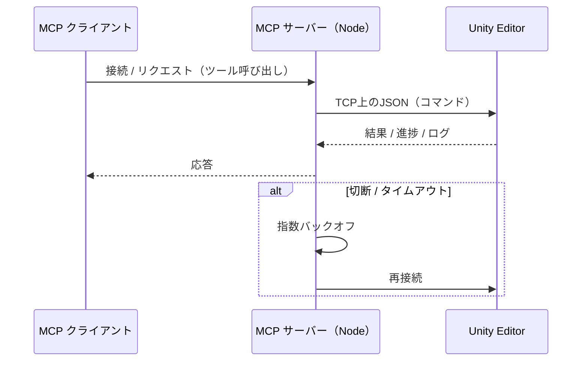
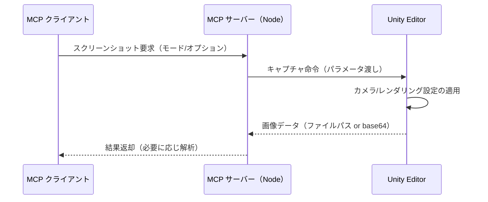
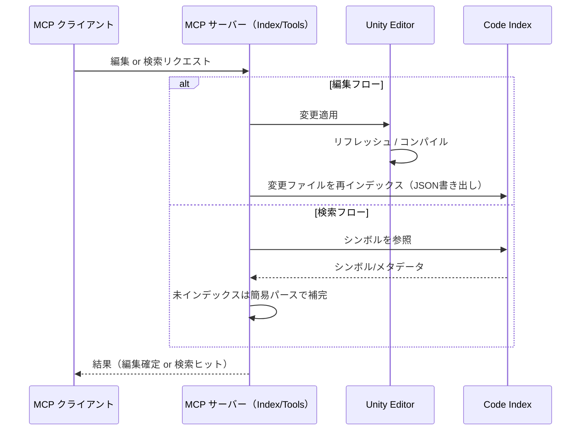

# Unity Editor MCP

[English](README.md) | 日本語

## 概要

Unity Editor MCP は、LLMクライアントからUnity Editorを自動化します。シンプルなインターフェースで、安全かつ再現性の高いエディタ操作を実現します。

### 関連ドキュメント

- 動画保存機能 計画: `docs/video-capture-plan.md`

### C#編集の方針（重要）

- C#の探索/参照/構造化編集は、Unityとは通信せず、リポジトリ同梱の外部CLI（roslyn-cli）で行います。
- 既存の `script_*` ツールは内部実装が外部CLIに切り替わっており、Unityのコンパイル/ドメインリロードの影響を受けません。
- 危険な行単位置換（line-based patch / pattern置換）は廃止しました。

初回セットアップ（roslyn-cli のビルド）

前提: .NET 9 SDK

- macOS/Linux: `./scripts/bootstrap-roslyn-cli.sh osx-arm64|osx-x64|linux-x64`
- Windows: `powershell -ExecutionPolicy Bypass -File scripts/bootstrap-roslyn-cli.ps1 -Rid win-x64`

出力先: `./.tools/roslyn-cli/<rid>/roslyn-cli`（自己完結バイナリ、インストール不要）

代表的な使い方（MCPツール）

- シンボル検索: `script_symbol_find { "name": "ClassName", "kind": "class" }`
- 参照検索: `script_refs_find { "name": "MethodName" }`
- メソッド本体置換（プリフライト→適用）:
  - `script_edit_structured { "operation": "replace_body", "path": "Packages/.../File.cs", "symbolName": "Class/Method", "newText": "{ /* ... */ }", "preview": true }`
  - エラーが無ければ `"preview": false` で適用
- 追記（クラス直後など）:
  - `script_edit_structured { "operation": "insert_after", "path": "...", "symbolName": "ClassName", "kind": "class", "newText": "\nprivate void X(){}\n", "preview": false }`

必要時のみ、Unity側で手動 `AssetDatabase.Refresh` を行ってください。

パフォーマンス（既定）

- 既定で `roslyn-cli serve`（常駐）を試行し、初回以降の起動コストを回避します。
- 明示的に無効化したい場合は `ROSLYN_CLI_MODE=oneshot`（または `off`）を設定してください。

## できること

- エディタ自動化: シーン/ゲームオブジェクト/コンポーネント/プレハブ/マテリアルの作成・変更
- UI自動化: UI要素の探索・操作・状態検証
- 入力シミュレーション: キーボード/マウス/ゲームパッド/タッチ（Input System のみ対応）
- ビジュアルキャプチャ: Game/Scene/Explorer/Window の確定的スクリーンショット、解析も可能
- コードベース認識: 外部Roslyn CLIにより、安全な構造化編集と正確な検索/参照
- プロジェクト制御: 一部のプロジェクト/エディタ設定の読み書き、ログ取得、コンパイル状態取得（スナップショット）

## 接続の仕組み（Unity ↔ MCPサーバー）

- ホスト/ポート: Unity側パッケージが `UNITY_HOST`/`UNITY_PORT`（既定 `localhost:6400`）でTCP待受。
- フロー: Unityプロジェクトを開く → パッケージが待受開始 → MCPクライアントがNodeサーバーを起動 → NodeがUnityへ接続。
- 設定: Configuration章（`project.root`、`project.codeIndexRoot`、`UNITY_MCP_CONFIG`）を参照。
- タイムアウト/リトライ: `reconnectDelay`/`maxReconnectDelay`/`reconnectBackoffMultiplier` による指数バックオフ。
- トラブルシュート: Unityが稼働中か、ポート6400の競合がないか、ホスト/ポート設定が一致しているかを確認。

アーキテクチャ図

```
┌────────────────┐        JSON-RPC (MCP)        ┌──────────────────────┐
│  MCP クライアント │ ───────────────────────────▶ │  Node MCP サーバー     │
│ (Claude/Codex/  │ ◀─────────────────────────── │ (@akiojin/unity-     │
│   Cursor など)  │        ツール応答              │ editor-mcp)          │
└────────────────┘                              └──────────┬───────────┘
                                                         TCP│6400
                                                            ▼
                                                   ┌───────────────────┐
                                                   │  Unity Editor     │
                                                   │ （パッケージがTCP   │
                                                   │   リスナーを起動） │
                                                   └───────────────────┘
```

シーケンス



## ディレクトリ構成

- `UnityEditorMCP/`: Unityプロジェクト（Editorブリッジ、ツール、サンプル）
- `mcp-server/`: Unityツールを公開する Node.js MCP サーバー
- `scripts/`: ローカル開発向けヘルパースクリプト

## セットアップ
- 対応バージョン: Unity 2020.3 LTS以降 / Node.js 18+ / npm
- MCPクライアント: Claude Desktop など

インストール
- Unity: Package Manager → Git URL から追加 → `https://github.com/akiojin/unity-editor-mcp.git?path=UnityEditorMCP/Packages/unity-editor-mcp`
- MCPクライアント設定（Claude Desktop例）:
  - macOS: `~/Library/Application Support/Claude/claude_desktop_config.json`
  - Windows: `%APPDATA%\\Claude\\claude_desktop_config.json`
  - 追記内容:
    ```json
    {
      "mcpServers": {
        "unity-editor-mcp": {
          "command": "npx",
          "args": ["@akiojin/unity-editor-mcp@latest"]
        }
      }
    }
    ```

1) Unity の Package Manager から本パッケージを導入（下記Git URL）
2) Unity プロジェクトを開く（パッケージがポート6400で待受）
3) MCPクライアントを設定して Node サーバーを起動（例は後述）

### 設定（.unity/config.json）

設定は任意で、未設定でも既定値で動作します。存在する場合の読込順は次のとおりです。

- `UNITY_MCP_CONFIG`（設定JSONへの絶対パス）
- `./.unity/config.json`（サーバープロセスのカレントディレクトリ基準）
- `~/.unity/config.json`（ユーザーグローバル）

注意:
- パスはそのまま使用されます。相対パスは設定ファイルの場所ではなく「プロセスのCWD」基準で解決されます。
- `~` や環境変数の展開は行いません。

代表的なキー:
- `project.root`: Unityプロジェクトのルート（`Assets/` を含むディレクトリ）
- `project.codeIndexRoot`: Code Index の出力先（既定: `<project.root>/Library/UnityMCP/CodeIndex`）

例（絶対パス推奨）:

```json
{
  "project": {
    "root": "/absolute/path/to/UnityProject",
    "codeIndexRoot": "/absolute/path/to/UnityProject/Library/UnityMCP/CodeIndex"
  }
}
```

チーム向け（相対）の例 — 常にリポジトリ直下から起動して `process.cwd()` を一定にしてください:

```json
{
  "project": {
    "root": ".",
    "codeIndexRoot": "./Library/UnityMCP/CodeIndex"
  }
}
```

ヒント: CWD依存を避けるには、起動時に `UNITY_MCP_CONFIG=/absolute/path/to/config.json` を指定してください。

#### 設定キー一覧

| キー | 型 | 既定値 | 説明 | 許容値 |
| --- | --- | --- | --- | --- |
| `project.root` | string | 自動検出（Unity接続 or 近傍の `Assets/` を含むディレクトリ） | Unityプロジェクトのルート。相対パスはプロセスのCWD基準。 | — |
| `project.codeIndexRoot` | string | `<project.root>/Library/UnityMCP/CodeIndex` | Code Index の保存先ルート。 | — |
| `unity.host` | string | `process.env.UNITY_HOST` または `localhost` | Unity Editor のTCPサーバーホスト。 | — |
| `unity.port` | number | `process.env.UNITY_PORT` または `6400` | Unity Editor のTCPサーバーポート。 | — |
| `unity.reconnectDelay` | number (ms) | `1000` | 再接続の初期待機時間。 | — |
| `unity.maxReconnectDelay` | number (ms) | `30000` | 再接続バックオフの最大待機時間。 | — |
| `unity.reconnectBackoffMultiplier` | number | `2` | 再接続の指数バックオフ倍率。 | — |
| `unity.commandTimeout` | number (ms) | `30000` | 各Unityコマンドのタイムアウト。 | — |
| `server.name` | string | `unity-editor-mcp-server` | MCPで公開されるサーバー名。 | — |
| `server.version` | string | `0.1.0` | サーバーのバージョン文字列。 | — |
| `server.description` | string | `MCP server for Unity Editor integration` | サーバーの説明。 | — |
| `logging.level` | string | `process.env.LOG_LEVEL` または `info` | 標準エラーへのログ出力レベル。 | `debug` / `info` / `warn` |
| `logging.prefix` | string | `[Unity Editor MCP]` | ログのプレフィックス。 | — |
| `search.defaultDetail` | string | `process.env.SEARCH_DEFAULT_DETAIL` または `compact` | 検索の既定詳細度。`compact` は `snippets` のエイリアス。 | `compact` / `metadata` / `snippets` / `full` |
| `search.engine` | string | `process.env.SEARCH_ENGINE` または `naive` | 検索エンジンの実装。 | `naive`（将来的に `treesitter` 予定） |

### GUID DB（台帳）

- 保存場所: ワークスペース直下の `./.unity/guid-db/` に保存されます。
- バージョン管理: `./.unity/guid-db/` をリポジトリにコミットして履歴を残す運用を推奨します。

## スクリーンショット

- Game/Scene/Explorer/Window の各ビューをキャプチャ可能。
- モード: `game` | `scene` | `explorer` | `window`。
- 主なオプション:
  - 解像度: `width`/`height`（Explorerは `camera.width`/`camera.height`）。
  - UI重畳: Game Viewで `includeUI`。
  - Explorerフレーミング: `explorerSettings.camera.*`（autoFrame、FOV、near/far、position/rotation、padding）。
  - 表示補助: `explorerSettings.display.*`（highlightTarget、showBounds、showColliders、showGizmos、backgroundColor、layers）。
  - ターゲット: `explorerSettings.target.*`（gameObject/tag/area/position、includeChildren）。
  - 出力: `outputPath`（`Assets/` 配下に保存）または base64 返却。
- 解析: UI検出や内容サマリも可能。

シーケンス



## 入力シミュレーション

- 対応: Unity Input System のみ対応（新Input Systemパッケージ）。
- 非対応: 旧 Input Manager（Project Settings → Input Manager）。
- 機能: キーボード/マウス/ゲームパッド/タッチの入力をエミュレートして、Play Mode やUI操作をテスト。
- 注意: プロジェクトが Input System を使用していない場合、シミュレーションによるゲーム操作は反映されません。

### コードインデックスと解析の仕組み（How it works）

本プロジェクトは、永続的なJSONインデックスを保持しません。`script_*` ツール呼び出し時に、外部の `roslyn-cli` がオンデマンドでRoslyn解析を実行し、権威的なシンボル/参照情報を返します。

- 責務分離
  - Unity: エディタ自動化のみ（シーン/オブジェクト/コンポーネント/スクリーンショットなど）。C#の解析は行いません。
  - Node(MCPサーバー): C#の解析・編集は外部 `roslyn-cli` に委譲（`.sln/.csproj` をMSBuildWorkspaceでロード）。

- CLIが内部で構築するもの
  - ソリューション/プロジェクトグラフ（.sln/.csproj準拠の依存解決）
  - RoslynのSyntaxTree/Compilation/SemanticModel（正確な識別子解決のため）
  - シンボルモデル（型/メンバーの名前空間・コンテナ・スパン、識別子参照の抽出など）

- 操作フロー
  1) MCPツール呼び出し（例: `script_symbol_find`）
  2) サーバーが `roslyn-cli ...` を生成・実行
  3) CLIが `{ path, name, kind, line, column, container, ns }` などのJSONを返却
  4) 編集系（`replace_body`/`insert_*`/`rename`）はプリフライト（メモリ上でコンパイル）→ エラーがあればブロック／問題なければワークスペース変更をアトミック適用
  5) Unity側の `AssetDatabase.Refresh` は必要時のみ手動実行（スクリプト再読み込み用途）

- セーフティ
  - 構造化編集のみ（メソッド本体置換・シンボル直前/直後の挿入・セマンティックリネーム）
  - プリフライトコンパイルでエラー誘発を事前に検知し、適用を抑止
  - 行単位の盲目的な置換は不使用

- パフォーマンス
  - オンデマンド実行のため初回ロードのコストはありますが、Unityのドメインリロードに非依存で安定
  - CIで自己完結バイナリを事前ビルドすると環境整備を短縮可能
  - 将来的に短命サーバー化して起動コストを抑えることも可能（MCPのI/Fはそのまま）

- 制約
  - 未保存のバッファは対象外（CLIはディスク上のファイルを解析）。実行前に保存してください
  - ネスト型/メンバーは `OuterType/InnerType/Method` のような `namePath` で解決

要するに、本プロジェクトにおける「コードインデックス」とは、キャッシュではなく “ツール呼び出し時にRoslynが生成する正確なシンボル/セマンティック情報” を指します。

アーキテクチャ（要点）

- Unity: エディタ操作のみ（解析はしない）
- Node: 解析・編集は外部 `roslyn-cli`（.sln/.csprojロード）
- JSONインデックス: 廃止（オンデマンド解析へ完全移行）

シーケンス



## その他クライアント

### Codex CLI

Codex の MCP サーバー設定は次のファイルに作成してください。

- macOS/Linux: `~/.codex/servers.json`
- Windows: `%USERPROFILE%\.codex\servers.json`

例:

```json
{
  "mcpServers": {
    "unity-editor-mcp": {
      "command": "npx",
      "args": ["@akiojin/unity-editor-mcp@latest"]
    }
  }
}
```

## トラブルシューティング（簡易）

- UnityのTCPが待受しない: プロジェクトを開き直し／ポート6400の占有を解除。
- Node.jsが接続できない: Unity稼働確認、FW設定、Unity/Nodeのログ確認。
- C#の型が見つからない: アセットをリフレッシュし、コンパイル完了まで待機。

注意: 本READMEに接続設計・スクリーンショット・コードインデックスの要点を集約しました.
