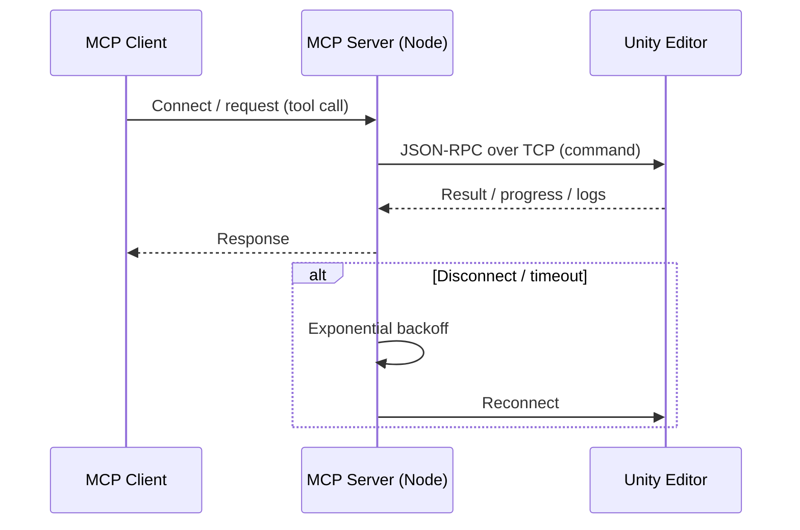
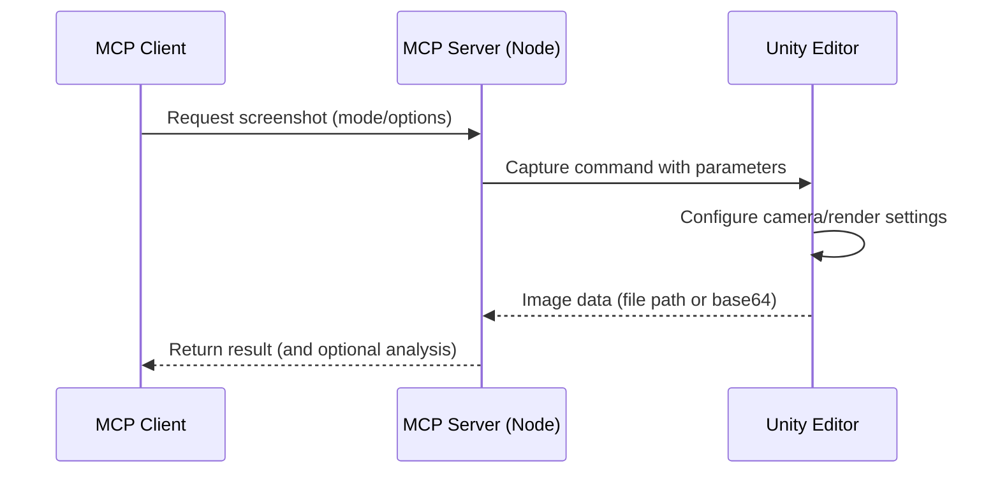
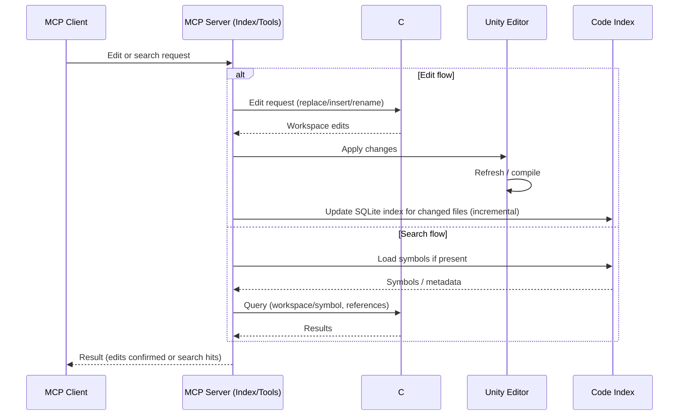

# Unity MCP Server

English | [日本語](README.ja.md)

## Overview

Unity MCP Server lets LLM-based clients automate the Unity Editor. It focuses on reliable, scriptable workflows with a simple interface and zero or low-configuration setup.

### Feature Specifications

- **All Features**: [`specs/`](specs/) - 15 features documented with SDD format (including Unity Test Execution)

### Development Process

This project follows **Spec-Driven Development (SDD)** and **Test-Driven Development (TDD)** methodologies:

- **Development Constitution**: [`memory/constitution.md`](memory/constitution.md) - Core development principles and requirements
- **Developer Guide**: [`CLAUDE.md`](CLAUDE.md) - Workflow, guidelines, and Spec Kit integration
- **TDD**: Red-Green-Refactor cycle enforced; tests written before implementation
- **Test Coverage**: Unit tests (80%+), Integration tests (100% critical paths)

See also: Spec Kit workflow (`/speckit.specify`, `/speckit.plan`, `/speckit.tasks`) for structured feature development.

### Git Hooks (Husky)

This project uses [Husky](https://typicode.github.io/husky/) to enforce code quality and commit message standards through Git hooks:

- **commit-msg**: Validates commit messages against [Conventional Commits](https://www.conventionalcommits.org/) using commitlint
- **pre-commit**: Runs ESLint, Prettier, and markdownlint on staged files
- **pre-push**: Executes test suite before pushing to remote
- **post-merge**: Notifies when package.json changes require dependency updates

#### Bypassing Hooks

In emergency situations, you can skip hooks with `--no-verify`:

```bash
git commit --no-verify -m "emergency fix"
git push --no-verify
```

**Note**: Use this sparingly. Hooks exist to maintain code quality and prevent CI failures.

#### Hook Configuration

- Commitlint: `.commitlintrc.json` (Conventional Commits rules)
- ESLint: `.eslintrc.json` (JavaScript code style)
- Prettier: `.prettierrc.json` (code formatting)
- Markdownlint: `.markdownlint.json` (Markdown rules)

See [CLAUDE.md](CLAUDE.md) for detailed development guidelines.

### Spec Kit (SDD) Conventions

- Spec Kit CLI v0.0.78 is installed under `.specify/` (scripts, templates, memory).
- Use `uvx --from git+https://github.com/github/spec-kit.git specify check` to verify the CLI and templates are up to date.
- Feature IDs always follow the `SPEC-[0-9a-f]{8}` pattern (e.g., `SPEC-1a2b3c4d`). The helper script skips git branch creation and stores the active feature in `.specify/.current-feature`.
- Templates are localized to Japanese; edit `/.specify/templates/*.md` when updating specs/plan/tasks/agent guides.
- Legacy wrappers remain in `scripts/` and delegate to the new `.specify/scripts/bash/` implementations for backward compatibility.

### C# Editing Policy (Important)

- All C# symbol/search/structured edits are performed via a self-contained C# Language Server (LSP) bundled in this repo; no Unity communication is involved.
- Existing `script_*` tools call the LSP under the hood, so edits are robust to Unity compilation/domain reload.
- Risky line-based patch/pattern replace tools were removed.

For Contributors

Developer note: the LSP is self-contained and auto-provisioned by the MCP server (fixed-version by tag). No .NET SDK is required for end users.

Common usage (MCP tools)

- Symbols: `script_symbol_find { "name": "ClassName", "kind": "class" }`
- References: `script_refs_find { "name": "MethodName" }`
- Replace body (preflight→apply):
  - `script_edit_structured { "operation": "replace_body", "path": "Packages/.../File.cs", "symbolName": "Class/Method", "newText": "{ /* ... */ }", "preview": true }`
  - then set `"preview": false` to apply if errors are empty
- Insert after class:
  - `script_edit_structured { "operation": "insert_after", "path": "...", "symbolName": "ClassName", "kind": "class", "newText": "\nprivate void X(){}\n", "preview": false }`
- Snippet tweaks (guard removal / condition swap):
  - `script_edit_snippet { "path": "Assets/Scripts/Foo.cs", "preview": true, "instructions": [{ "operation": "delete", "anchor": { "type": "text", "target": "        if (value == null) return;\n" } }] }`

Run `AssetDatabase.Refresh` in Unity manually only when needed.

Performance

- The server starts and keeps a persistent LSP process by default to avoid cold starts.

## Automated Release Management

This project uses **semantic-release** for fully automated version management and publishing:

- **Version Detection**: Automatically determines version bumps based on Conventional Commits
  - `fix:` commits → patch version (e.g., 2.26.0 → 2.26.1)
  - `feat:` commits → minor version (e.g., 2.26.0 → 2.27.0)
  - `BREAKING CHANGE:` or `feat!:` → major version (e.g., 2.26.0 → 3.0.0)
- **Release Flow**: develop → release/vX.Y.Z → main
- **Publishing**: Automated npm, OpenUPM, and GitHub Release publication
- **Multi-platform Builds**: Automatic csharp-lsp builds for all supported platforms

See [CLAUDE.md](CLAUDE.md) for detailed release workflow documentation.

## LLM Optimization Principles

- Prefer small responses: enable paging and set conservative limits.
- Use snippets: avoid full file reads; favor short context windows (1–2 lines).
- Scope aggressively: restrict by `Assets/` or `Packages/`, kind, and exact names.
- Favor summaries: rely on tool-side summarized payloads where available.
- Avoid previews unless necessary: apply directly when safe to reduce payload.
- Keep image/video resolutions minimal and avoid base64 unless immediately analyzed.

Suggested caps
- Search: `pageSize≤20`, `maxBytes≤64KB`, `snippetContext=1–2`, `maxMatchesPerFile≤5`.
- Hierarchy: `nameOnly=true`, `maxObjects 100–500` (details: 10–50).
- Script read: 30–40 lines around the target; set `maxBytes`.
- Structured edits: responses are summarized (errors ≤30, message ≤200 chars; large text ≤1000 chars).

## Safe Structured Edit Playbook

1) Locate symbols: `script_symbols_get` or `script_symbol_find` (prefer `kind` and `exact`).
   - Use project-relative paths under `Assets/` or `Packages/` only.
   - Use results’ container to build `namePath` like `Outer/Nested/Member`.
2) Inspect minimal code: `script_read` with 30–40 lines around the symbol.
3) Edit safely:
   - Use `script_edit_snippet` for ≤80-character changes anchored to exact text (null guard removal, condition tweaks, small insertions). The tool validates via the bundled LSP (Roslyn-backed) diagnostics and rolls back on errors.
   - Use `script_edit_structured` for class/namespace-level insertions and method body replacements. Insert targets must be class/namespace symbols; `replace_body` must include braces and be self-contained.
   - Use `preview=true` only when risk is high; otherwise apply directly to reduce payload.
4) Optional refactor/remove: `script_refactor_rename`, `script_remove_symbol` with preflight.
5) Verify: compile state and, if needed, targeted `script_read` again.

## What It Can Do

- Editor automation: create/modify scenes, GameObjects, components, prefabs, materials
- UI automation: locate and interact with UI, validate UI state
- Input simulation: keyboard/mouse/gamepad/touch for playmode testing (Input System only)
- Visual capture: deterministic screenshots from Game/Scene/Explorer/Window views, optional analysis
- Code base awareness: safe structured edits and accurate symbol/search powered by the bundled C# LSP
- Project control: read/update selected project/editor settings; read logs, monitor compilation
- **Addressables management**: register/organize assets, manage groups, build automation, dependency analysis

## Unity–MCP Connection

- Host/Port: Unity package opens a TCP server on `UNITY_HOST`/`UNITY_PORT` (default `localhost:6400`).
- Flow: Open Unity project → package starts listening → your MCP client launches the Node server → Node connects to Unity.
- Config: See Configuration section (`project.root`, `project.codeIndexRoot`, `UNITY_MCP_CONFIG`).
- Timeouts/Retry: Exponential backoff with `reconnectDelay`/`maxReconnectDelay`/`reconnectBackoffMultiplier`.
- Troubleshooting: Ensure Unity is running, port 6400 is free, and host/port match.

Architecture

```
┌────────────────┐        JSON-RPC (MCP)        ┌──────────────────────┐
│  MCP Client    │ ───────────────────────────▶ │  Node MCP Server     │
│ (Claude/Codex/ │ ◀─────────────────────────── │ (@akiojin/unity-     │
│   Cursor …)    │        tool responses        │ mcp-server)          │
└────────────────┘                              └──────────┬───────────┘
                                                         TCP│6400
                                                            ▼
                                                   ┌───────────────────┐
                                                   │  Unity Editor     │
                                                   │  (Package opens   │
                                                   │   TCP listener)   │
                                                   └───────────────────┘
```

Sequence



## Setup

- Unity 2020.3 LTS or newer
- Node.js 18.x or 20.x LTS (the server refuses to start on newer majors) and pnpm (via Corepack)
  - Prefer Node.js 20.x for the best compatibility (prebuilt `better-sqlite3` binaries are available); Node.js 18.x works, but anything ≥21 is rejected at launch.
- Claude Desktop or another MCP-compatible client

Installation
- In Unity: Package Manager → Add from git URL → `https://github.com/akiojin/unity-mcp-server.git?path=UnityMCPServer/Packages/unity-mcp-server`
- Configure MCP client (Claude Desktop example):
  - macOS: `~/Library/Application Support/Claude/claude_desktop_config.json`
  - Windows: `%APPDATA%\\Claude\\claude_desktop_config.json`
  - Add:
    ```json
    {
      "mcpServers": {
        "unity-mcp-server": {
          "command": "npx",
          "args": ["@akiojin/unity-mcp-server@latest"]
        }
      }
    }
    ```

### MCP Server Environment Setup

You must install the MCP server's pnpm-managed dependencies **on the same OS where the server runs** so that native modules such as `better-sqlite3` are built for the correct platform.

- **General rule**: if your `.mcp.json` uses `"command": "node"` (e.g. `node bin/unity-mcp-server serve`), run `pnpm install` (or `pnpm install --frozen-lockfile`) inside the directory where the package lives _on that machine/container_ before launching the MCP client.
- **pnpm build approval**: pnpm v10+ blocks native build scripts until you approve them. Run `pnpm approve-builds better-sqlite3` once (select the package and confirm) so the SQLite binding can compile successfully.citeturn1view0
- **`npx` launch**: the README example above (`npx @akiojin/unity-mcp-server@latest`) downloads dependencies at runtime and works on the supported Node.js versions (18.x / 20.x). Node.js 21+ is not supported; the server exits early with a version error.
- **Avoid sharing `node_modules` across operating systems** (Windows ↔ Linux/macOS). Native binaries compiled for one platform cannot be reused on another.

Environment-specific notes:

- **Windows (PowerShell / Command Prompt)**
  - Install Node.js 20.x LTS (or 18.x if you prefer). Newer major versions are unsupported.
  - In your workspace: change into the installed package directory (for repo clones: `cd C:\path\to\unity-mcp-server\mcp-server`) then run `pnpm install --frozen-lockfile`.
  - Point `.mcp.json` to `node` or keep using `npx` once dependencies exist.

- **Windows Subsystem for Linux (WSL)**
  - Keep the repository on the Linux filesystem (e.g. `/home/<user>/unity-mcp-server`).
  - Use Node.js 20.x (or 18.x) inside WSL.
  - Run `pnpm install --frozen-lockfile` inside the installed package directory (for repo clones: `/home/<user>/unity-mcp-server/mcp-server`).

- **Docker / Linux containers**
  - Base your image on Node.js 20.x (or 18.x). Images with newer Node versions are unsupported and will fail fast.
  - During the image build run `pnpm install --filter mcp-server --frozen-lockfile` (or `pnpm install --frozen-lockfile` inside the package directory) so the container has platform-matched dependencies.
  - Do not bind-mount a host `node_modules` directory into the container.

- **macOS**
  - Install Node.js 20.x (e.g. `brew install node@20` and add it to `PATH`). Node 18.x also works; newer majors are unsupported.
  - Run `pnpm install --frozen-lockfile` wherever the package is installed (for repo clones: `cd ~/unity-mcp-server/mcp-server && pnpm install --frozen-lockfile`).

After installation you can verify the server with `node mcp-server/bin/unity-mcp-server --version`. If `better-sqlite3` fails to load, reinstall the dependencies _inside the target environment_ or rebuild with `pnpm rebuild better-sqlite3 --filter mcp-server --build-from-source` once the toolchain is present.

## Usage Workflow

1. **Install the Unity package.** Use the Git URL listed above or, once OpenUPM is configured, run `openupm add com.akiojin.unity-mcp-server` inside your project.
2. **Register OpenUPM scopes when needed.** Installing via Git does not require extra setup, but installing from OpenUPM or letting the MCP registry tool manage packages does. See [Adding the OpenUPM scoped registry](#adding-the-openupm-scoped-registry).
3. **Install Node dependencies.** In a local clone run `npm ci --workspace=mcp-server` (or `cd mcp-server && npm ci`). When launching with `npx`, dependencies are resolved for you.
4. **Launch the MCP server.**

   ```bash
   npm ci --workspace=mcp-server            # once per machine/OS image
   node mcp-server/bin/unity-mcp-server     # foreground session
   # or: npm --workspace=mcp-server run dev # auto-restarts on file changes
   ```

5. **Point your MCP client at the server.** Update `claude_desktop_config.json` (or your client's equivalent) so `Unity MCP Server` appears in the tool list.
6. **Smoke-test the round trip.** With Unity open, call `system_ping` or `package_registry_config` to confirm the transport, then proceed with higher-level tools (scene, script, screenshot, etc.).

> Tip: `npx @akiojin/unity-mcp-server@latest` downloads and runs the latest published build without cloning this repository; only use the clone when you plan to modify the code.

## Adding the OpenUPM Scoped Registry

Unity does not know about OpenUPM by default. Add the scoped registry whenever:

- You plan to install `com.akiojin.unity-mcp-server` (or other packages) from OpenUPM/the `openupm` CLI.
- You want to use the MCP `package_registry_config` tool to add/remove package scopes automatically.

The reference project under `UnityMCPServer/` already ships with a working example (`ProjectSettings/PackageManagerSettings.asset` and `Packages/manifest.json`), but your own Unity projects must opt in.

### Option A — Project Settings / `Packages/manifest.json`

1. Open Unity and navigate to `Edit ▸ Project Settings… ▸ Package Manager`.
2. Under **Scoped Registries**, click **+**.
3. Use the following values (add only the scopes you need; at minimum include `com.akiojin` or the full package ID):
   - **Name**: `OpenUPM`
   - **URL**: `https://package.openupm.com`
   - **Scopes**: `com.akiojin`, `com.akiojin.unity-mcp-server`, plus any other vendor scopes you rely on (`com.cysharp`, `com.neuecc`, `jp.keijiro`, etc.).
4. Click **Apply**. Unity writes the same data to `Packages/manifest.json`, so keep the file under version control.

**Example snippet**

```json
"scopedRegistries": [
  {
    "name": "OpenUPM",
    "url": "https://package.openupm.com",
    "scopes": [
      "com.akiojin",
      "com.akiojin.unity-mcp-server",
      "com.cysharp",
      "com.neuecc",
      "jp.keijiro"
    ]
  }
]
```

Run `openupm add com.akiojin.unity-mcp-server` after the registry is present if you prefer the CLI; it updates `manifest.json` for you.

### Option B — Use the MCP registry tool

1. Launch Unity and start the Node MCP server.
2. From your MCP client, call the `package_registry_config` tool (some clients display it as `UnityMCP__package_registry_config` / `UnityMCP__registry_config`).
3. Supply the `add_openupm` action and any custom scopes:

```json
{
  "action": "add_openupm",
  "autoAddPopular": true,
  "scopes": ["com.akiojin"]
}
```

The tool updates `Packages/manifest.json`, ensures the registry exists (creating or merging scopes), and requests an AssetDatabase refresh so the Package Manager picks up the change.

### Configuration (.unity/config.json)

Configuration is optional; defaults work without any config. When present, the server loads configuration in this order:

- `UNITY_MCP_CONFIG` (absolute path to a JSON file)
- Nearest `./.unity/config.json` discovered by walking up from the current working directory
- `~/.unity/config.json` (user-global)

Notes:
- The server derives a fixed `WORKSPACE_ROOT` from the discovered `.unity/config.json` location and uses it consistently (independent of later `process.cwd()` changes).
- Relative paths in the config should be written relative to this workspace root.
- `~` and environment variable expansion are not applied to path values.

Common keys:
- `project.root`: Unity project root directory (contains `Assets/`).
- `project.codeIndexRoot`: Code Index output directory (default: `<workspaceRoot>/.unity/cache/code-index`).

Examples:

```json
{
  "project": {
    "root": "/absolute/path/to/UnityProject",
    "codeIndexRoot": "/absolute/path/to/workspace/.unity/cache/code-index"
  }
}
```

Team-friendly (relative) example — recommended when the repo layout is stable:

```json
{
  "project": {
    "root": ".",
    "codeIndexRoot": "./.unity/cache/code-index"
  }
}
```

Tip: Prefer `UNITY_MCP_CONFIG=/absolute/path/to/config.json` to make discovery explicit.

#### Configuration Keys

| Key | Type | Default | Description | Allowed values |
| --- | --- | --- | --- | --- |
| `project.root` | string | auto-detect (Unity connection or nearest directory with `Assets/`) | Unity project root directory. Relative paths resolve from process CWD. | — |
| `project.codeIndexRoot` | string | `<workspaceRoot>/.unity/cache/code-index` | Code Index storage root. | — |
| `unity.unityHost` | string | `process.env.UNITY_UNITY_HOST` &#124; `process.env.UNITY_BIND_HOST` &#124; `process.env.UNITY_HOST` &#124; `localhost` | Host/interface where the Unity Editor listens for MCP commands. | — |
| `unity.mcpHost` | string | `process.env.UNITY_MCP_HOST` &#124; `process.env.UNITY_CLIENT_HOST` &#124; `unity.unityHost` | Hostname/IP the Node MCP server uses when connecting to Unity. e.g. `host.docker.internal` inside Docker. | — |
| `unity.bindHost` | string | `process.env.UNITY_BIND_HOST` &#124; `unity.unityHost` | Legacy alias for the Unity listener interface. Kept for backwards compatibility. | — |
| `unity.host` | string | legacy | Legacy alias retained for compatibility; resolves the same as `unity.unityHost`. | — |
| `unity.port` | number | `process.env.UNITY_PORT` or `6400` | Port of Unity Editor TCP server. | — |
| `unity.reconnectDelay` | number (ms) | `1000` | Initial delay before reconnect attempts. | — |
| `unity.maxReconnectDelay` | number (ms) | `30000` | Maximum backoff delay between reconnect attempts. | — |
| `unity.reconnectBackoffMultiplier` | number | `2` | Exponential backoff multiplier for reconnects. | — |
| `unity.commandTimeout` | number (ms) | `30000` | Timeout for individual Unity commands. | — |
| `server.name` | string | `unity-mcp-server` | Server name exposed via MCP. | — |
| `server.version` | string | `0.1.0` | Server version string. | — |
| `server.description` | string | `MCP server for Unity Editor integration` | Human-readable description. | — |
| `logging.level` | string | `process.env.LOG_LEVEL` or `info` | Log verbosity for stderr logging. | `debug`, `info`, `warn` |
| `logging.prefix` | string | `[Unity MCP Server]` | Log prefix used in stderr. | — |
| `search.defaultDetail` | string | `process.env.SEARCH_DEFAULT_DETAIL` or `compact` | Default return detail for search; `compact` maps to `snippets`. | `compact`, `metadata`, `snippets`, `full` |
| `search.engine` | string | `process.env.SEARCH_ENGINE` or `naive` | Search engine implementation. | `naive` (treesitter planned) |

### Workspace Directory (`.unity/`)
- `config.json` is the only file intended for version control; keep it alongside your repo to define the workspace root.
- Everything else under `.unity/` (e.g., `cache/`, `tools/`) is generated at runtime and should remain untracked.
- The Code Index database now lives at `.unity/cache/code-index/` next to other transient assets.

Tip: when Unity runs on your host machine and the MCP server runs inside Docker, keep `unity.unityHost` as `localhost` (Unity listens locally) and set `unity.mcpHost` to `host.docker.internal` so the container can reach the editor.
## Screenshot System

- Capture Game View, Scene View, Explorer（AI-framed）, or a specific Editor window.
- Modes: `game` | `scene` | `explorer` | `window`.
- Options:
  - Resolution: `width`/`height` (or in explorer: `camera.width`/`camera.height`).
  - UI Overlay: `includeUI` for Game View.
  - Explorer framing: `explorerSettings.camera.*` (autoFrame, FOV, near/far clip, position/rotation, padding).
  - Display aids: `explorerSettings.display.*` (highlightTarget, showBounds, showColliders, showGizmos, backgroundColor, layers).
  - Target focus: `explorerSettings.target.*` (gameObject/tag/area/position, includeChildren).
  - Output: always saved to `<workspace>/.unity/capture/screenshot_<mode>_<timestamp>.png`. Set `encodeAsBase64=true` only when you need inline analysis.
  - The Node server always includes `workspaceRoot` when commanding Unity; Unity prioritizes it and falls back to `.unity/config.json` only if missing.
- Analysis: optional UI detection and content summary.

Sequence



## Input Simulation

- Supported: Unity Input System only (new Input System package).
- Not supported: Legacy Input Manager (Project Settings → Input Manager).
- Capabilities: simulate keyboard, mouse, gamepad, and touch input for playmode testing and UI interaction.
- Tip: Ensure your project uses Input System; otherwise simulated input will not affect gameplay.

## C# Language Server (LSP)

The project bundles a self-contained C# Language Server (LSP). The MCP server auto-downloads and manages its lifecycle. `script_*` tools talk to the LSP under the hood:

- Index: scans all `.cs` with `documentSymbol` and persists to SQLite (`.unity/cache/code-index`)
- Find symbols/references: `workspace/symbol` + LSP extensions
- Edits: rename/replace/insert/remove via LSP extensions
- Safety: structured edits, preview/apply options, no blind line-based patches

**Auto-Download/Update**: LSP binary is auto-fetched per runtime (no .NET SDK required). Version is pinned to MCP server version.

**Recovery**: If LSP exits unexpectedly, client auto-retries once. For corrupted downloads, delete `mcp-server/bin/csharp-lsp*` and retry.

Tests

- Script tools tests are consolidated in `tests/test-mcp-script-tools.md` (Japanese, MCP ツール前提)。
- Additional indexing scenario: `tests/natural-language/indexing-incremental.md`.

Indexing Settings

- The MCP server can periodically refresh the SQLite index (incremental) when enabled.
- Configure via environment variables (or `.unity/config.json` overrides):
  - `INDEX_WATCH=true` to enable periodic updates (default: false)
  - `INDEX_WATCH_INTERVAL_MS=15000` polling interval (default: 15000)
  - `INDEX_CONCURRENCY=8` max concurrent LSP requests (default: 8)
  - `INDEX_RETRY=2` per-file documentSymbol retry attempts (default: 2)
  - `INDEX_REPORT_EVERY=500` progress log interval in files (default: 500)

Sequence



## Other Clients

### Codex CLI

Configure MCP servers for Codex by creating a config file:

- macOS/Linux: `~/.codex/servers.json`
- Windows: `%USERPROFILE%\.codex\servers.json`

Example:

```json
{
  "mcpServers": {
    "unity-mcp-server": {
      "command": "npx",
      "args": ["@akiojin/unity-mcp-server@latest"]
    }
  }
}
```

## Troubleshooting

- Unity TCP not listening: reopen project; ensure port 6400 is free.
- Node.js cannot connect: Unity running? firewall? logs in Unity/Node terminals.
- C# types missing: refresh assets and wait until compilation completes.

## Release Process

### Automated Release Flow

This project uses [semantic-release](https://semantic-release.gitbook.io/) with [Conventional Commits](https://www.conventionalcommits.org/) for fully automated releases.

**Note**: Testing automated release workflow.

#### Three-Tier Release Flow (feature → develop → main)

This project implements a **three-tier release workflow** for controlled and predictable releases:

1. **Feature Development** (feature branches)
   - Create feature branch: `feature/SPEC-xxxxxxxx`
   - Commit with Conventional Commits
   - Run `finish-feature.sh` → auto-create PR to `develop`

2. **Integration Stage** (`develop` branch)
   - Required checks pass → auto-merge to `develop`
   - Multiple features accumulate in `develop`
   - No releases triggered from `develop`

3. **Production Release** (`main` branch)
   - Run `/release` command → create `develop` → `main` PR
   - Required checks pass → auto-merge to `main`
   - **semantic-release auto-executes**: version bump, CHANGELOG, tag creation
   - **csharp-lsp Build**: all platforms → GitHub Release
   - **npm Publish**: MCPサーバー → npmjs.com

**Benefits**:
- 🎯 Controlled release timing (manual `/release` trigger)
- 🔄 Multiple features can be bundled into one release
- 🛡️ `develop` acts as integration/staging before production
- 📦 Single version across all components (mcp-server, Unity Package, csharp-lsp)

#### How It Works (Legacy Two-Tier)

The previous two-tier flow (feature → main) is deprecated:

1. **Developer**: Create feature branch, commit with Conventional Commits, create PR
2. **Auto-Merge**: Required checks pass → automatic merge to `main`
3. **semantic-release**: Analyzes commits → determines version → updates package.json (mcp-server + Unity Package) → generates CHANGELOG.md → creates tag (`v*`)
4. **csharp-lsp Build**: Triggered by tag → builds all platforms → creates GitHub Release
5. **npm Publish**: Triggered by Release → waits for csharp-lsp-manifest.json → publishes to npm

All components (mcp-server, Unity Package, csharp-lsp) are released with the same version number.

#### Commit Message Format

Use Conventional Commits to trigger automatic version bumps:

- `feat: Add new feature` → **minor** version (2.16.3 → 2.17.0)
- `fix: Resolve bug` → **patch** version (2.16.3 → 2.16.4)
- `feat!: Breaking change` or `BREAKING CHANGE:` in body → **major** version (2.16.3 → 3.0.0)
- `chore:`, `docs:`, `test:` → no version bump

Examples:

```bash
git commit -m "feat: Add video capture support"
git commit -m "fix: Resolve screenshot path issue"
git commit -m "feat!: Remove deprecated API"
```

#### Manual Release (if needed)

If automated release fails, you can manually trigger workflows:

1. Go to Actions tab on GitHub
2. Select "Release" workflow
3. Click "Run workflow" on `main` branch

#### Troubleshooting

- **No release created**: Check if commits follow Conventional Commits format
- **csharp-lsp build failed**: npm publish will timeout after 20 minutes
- **Version mismatch**: Ensure Unity Package version is synced (automatic via `sync-unity-package-version.js`)

#### Version Synchronization

- **mcp-server**: Updated by semantic-release
- **Unity Package**: Auto-synced via `scripts/sync-unity-package-version.js`
- **csharp-lsp**: Tagged with same version, binaries attached to GitHub Release
- **CHANGELOG.md**: Auto-generated from commit messages

## Repository Structure (Workspace Root)

- `.unity/`
  - `config.json`: Workspace settings. `project.root` points to the Unity project root. The server fixes `WORKSPACE_ROOT` based on this.
  - `capture/`: Fixed output location for screenshots/videos (Git-ignored).
- `UnityMCPServer/` (Unity project)
  - `Packages/unity-mcp-server/**`: UPM package (source of truth)
  - `Assets/**`: samples/tests only (no implementation code)
- `mcp-server/` (Node MCP server)
  - Reads `./.unity/config.json` and fixes `WORKSPACE_ROOT`. Always passes it to Unity for capture commands.
- `csharp-lsp/` (Roslyn-based CLI)
  - Self-contained binary, invoked by the MCP server for symbol/search/edit operations.
