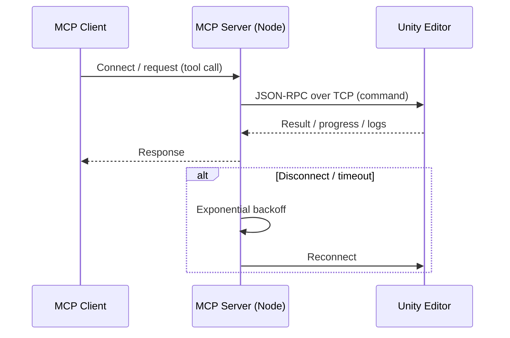
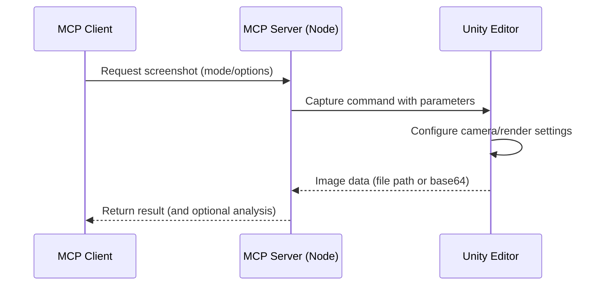
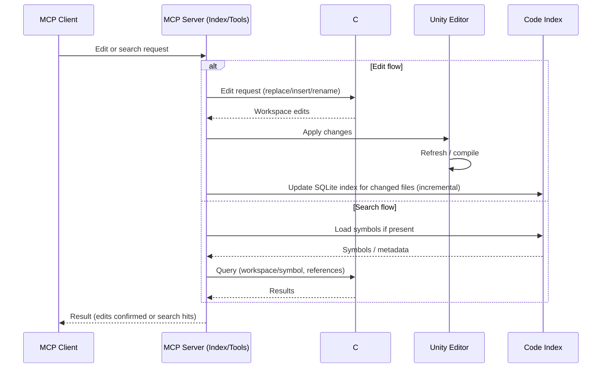

# Unity Editor MCP

English | [日本語](README.ja.md)

## Overview

Unity Editor MCP lets LLM-based clients automate the Unity Editor. It focuses on reliable, scriptable workflows with a simple interface and zero- or low-configuration setup.

### Related Docs

- Video Capture Feature Plan: `docs/video-capture-plan.md`
- Planned: C# Language Server (self-contained) RFC: `docs/RFCs/0001-csharp-lsp.md`

### Development Process

This project follows **Spec-Driven Development (SDD)** and **Test-Driven Development (TDD)** methodologies:

- **Development Constitution**: [`memory/constitution.md`](memory/constitution.md) - Core development principles and requirements
- **TDD Workflow**: [`docs/development/tdd-workflow.md`](docs/development/tdd-workflow.md) - Red-Green-Refactor cycle guide
- **Test Coverage Strategy**: [`docs/development/test-coverage-strategy.md`](docs/development/test-coverage-strategy.md) - Coverage goals and measurement
- **Developer Guide**: [`CLAUDE.md`](CLAUDE.md) - Workflow, guidelines, and Spec Kit integration

See also: Spec Kit workflow (`/specify`, `/plan`, `/tasks`) for structured feature development.

### C# Editing Policy (Important)

- All C# symbol/search/structured edits are performed via a self-contained C# Language Server (LSP) bundled in this repo; no Unity communication is involved.
- Existing `script_*` tools call the LSP under the hood, so edits are robust to Unity compilation/domain reload.
- Risky line-based patch/pattern replace tools were removed.

For Contributors

Developer note: the LSP is self-contained and auto-provisioned by the MCP server (fixed-version by tag). No .NET SDK is required for end users.

Common usage (MCP tools)

- Symbols: `script_symbol_find { "name": "ClassName", "kind": "class" }`
- References: `script_refs_find { "name": "MethodName" }`
- Replace body (preflight→apply):
  - `script_edit_structured { "operation": "replace_body", "path": "Packages/.../File.cs", "symbolName": "Class/Method", "newText": "{ /* ... */ }", "preview": true }`
  - then set `"preview": false` to apply if errors are empty
- Insert after class:
  - `script_edit_structured { "operation": "insert_after", "path": "...", "symbolName": "ClassName", "kind": "class", "newText": "\nprivate void X(){}\n", "preview": false }`

Run `AssetDatabase.Refresh` in Unity manually only when needed.

Performance

- The server starts and keeps a persistent LSP process by default to avoid cold starts.

## LLM Optimization Principles

- Prefer small responses: enable paging and set conservative limits.
- Use snippets: avoid full file reads; favor short context windows (1–2 lines).
- Scope aggressively: restrict by `Assets/` or `Packages/`, kind, and exact names.
- Favor summaries: rely on tool-side summarized payloads where available.
- Avoid previews unless necessary: apply directly when safe to reduce payload.
- Keep image/video resolutions minimal and avoid base64 unless immediately analyzed.

Suggested caps
- Search: `pageSize≤20`, `maxBytes≤64KB`, `snippetContext=1–2`, `maxMatchesPerFile≤5`.
- Hierarchy: `nameOnly=true`, `maxObjects 100–500` (details: 10–50).
- Script read: 30–40 lines around the target; set `maxBytes`.
- Structured edits: responses are summarized (errors ≤30, message ≤200 chars; large text ≤1000 chars).

## Safe Structured Edit Playbook

1) Locate symbols: `script_symbols_get` or `script_symbol_find` (prefer `kind` and `exact`).
   - Use project-relative paths under `Assets/` or `Packages/` only.
   - Use results’ container to build `namePath` like `Outer/Nested/Member`.
2) Inspect minimal code: `script_read` with 30–40 lines around the symbol.
3) Edit safely: `script_edit_structured` (insert_before/insert_after/replace_body).
   - Insert targets class/namespace (never method).
   - `replace_body` must include braces and be self-contained.
   - Use `preview=true` only when risk is high; otherwise apply to avoid extra tokens.
4) Optional refactor/remove: `script_refactor_rename`, `script_remove_symbol` with preflight.
5) Verify: compile state and, if needed, targeted `script_read` again.

## What It Can Do

- Editor automation: create/modify scenes, GameObjects, components, prefabs, materials
- UI automation: locate and interact with UI, validate UI state
- Input simulation: keyboard/mouse/gamepad/touch for playmode testing (Input System only)
- Visual capture: deterministic screenshots from Game/Scene/Explorer/Window views, optional analysis
- Code base awareness: safe structured edits and accurate symbol/search powered by the bundled C# LSP
- Project control: read/update selected project/editor settings; read logs, monitor compilation

## Unity–MCP Connection

- Host/Port: Unity package opens a TCP server on `UNITY_HOST`/`UNITY_PORT` (default `localhost:6400`).
- Flow: Open Unity project → package starts listening → your MCP client launches the Node server → Node connects to Unity.
- Config: See Configuration section (`project.root`, `project.codeIndexRoot`, `UNITY_MCP_CONFIG`).
- Timeouts/Retry: Exponential backoff with `reconnectDelay`/`maxReconnectDelay`/`reconnectBackoffMultiplier`.
- Troubleshooting: Ensure Unity is running, port 6400 is free, and host/port match.

Architecture

```
┌────────────────┐        JSON-RPC (MCP)        ┌──────────────────────┐
│  MCP Client    │ ───────────────────────────▶ │  Node MCP Server     │
│ (Claude/Codex/ │ ◀─────────────────────────── │ (@akiojin/unity-     │
│   Cursor …)    │        tool responses        │ mcp-server)          │
└────────────────┘                              └──────────┬───────────┘
                                                         TCP│6400
                                                            ▼
                                                   ┌───────────────────┐
                                                   │  Unity Editor     │
                                                   │  (Package opens   │
                                                   │   TCP listener)   │
                                                   └───────────────────┘
```

Sequence



## Directory Structure

- `UnityMCPServer/`: Unity project (Editor bridge, tools, samples)
- `mcp-server/`: Node.js MCP server that exposes Unity tools
- `scripts/`: Helper scripts for local development

## Setup

- Unity 2020.3 LTS or newer
- Node.js 18+ and npm
- Claude Desktop or another MCP-compatible client

Installation
- In Unity: Package Manager → Add from git URL → `https://github.com/akiojin/unity-mcp-server.git?path=UnityMCPServer/Packages/unity-mcp-server`
- Configure MCP client (Claude Desktop example):
  - macOS: `~/Library/Application Support/Claude/claude_desktop_config.json`
  - Windows: `%APPDATA%\\Claude\\claude_desktop_config.json`
  - Add:
    ```json
    {
      "mcpServers": {
        "unity-mcp-server": {
          "command": "npx",
          "args": ["@akiojin/unity-mcp-server@latest"]
        }
      }
    }
    ```

Usage Flow
- Open Unity project (TCP listener starts on port 6400)
- Start your MCP client and call tools (e.g., ping, scene, script tools)

### Configuration (.unity/config.json)

Configuration is optional; defaults work without any config. When present, the server loads configuration in this order:

- `UNITY_MCP_CONFIG` (absolute path to a JSON file)
- Nearest `./.unity/config.json` discovered by walking up from the current working directory
- `~/.unity/config.json` (user-global)

Notes:
- The server derives a fixed `WORKSPACE_ROOT` from the discovered `.unity/config.json` location and uses it consistently (independent of later `process.cwd()` changes).
- Relative paths in the config should be written relative to this workspace root.
- `~` and environment variable expansion are not applied to path values.

Common keys:
- `project.root`: Unity project root directory (contains `Assets/`).
- `project.codeIndexRoot`: Code Index output directory (default: `<project.root>/Library/UnityMCP/CodeIndex`).

Examples:

```json
{
  "project": {
    "root": "/absolute/path/to/UnityProject",
    "codeIndexRoot": "/absolute/path/to/UnityProject/Library/UnityMCP/CodeIndex"
  }
}
```

Team-friendly (relative) example — recommended when the repo layout is stable:

```json
{
  "project": {
    "root": ".",
    "codeIndexRoot": "./Library/UnityMCP/CodeIndex"
  }
}
```

Tip: Prefer `UNITY_MCP_CONFIG=/absolute/path/to/config.json` to make discovery explicit.

#### Configuration Keys

| Key | Type | Default | Description | Allowed values |
| --- | --- | --- | --- | --- |
| `project.root` | string | auto-detect (Unity connection or nearest directory with `Assets/`) | Unity project root directory. Relative paths resolve from process CWD. | — |
| `project.codeIndexRoot` | string | `<project.root>/Library/UnityMCP/CodeIndex` | Code Index storage root. | — |
| `unity.host` | string | `process.env.UNITY_HOST` or `localhost` | Hostname/IP of Unity Editor TCP server. | — |
| `unity.port` | number | `process.env.UNITY_PORT` or `6400` | Port of Unity Editor TCP server. | — |
| `unity.reconnectDelay` | number (ms) | `1000` | Initial delay before reconnect attempts. | — |
| `unity.maxReconnectDelay` | number (ms) | `30000` | Maximum backoff delay between reconnect attempts. | — |
| `unity.reconnectBackoffMultiplier` | number | `2` | Exponential backoff multiplier for reconnects. | — |
| `unity.commandTimeout` | number (ms) | `30000` | Timeout for individual Unity commands. | — |
| `server.name` | string | `unity-mcp-server` | Server name exposed via MCP. | — |
| `server.version` | string | `0.1.0` | Server version string. | — |
| `server.description` | string | `MCP server for Unity Editor integration` | Human-readable description. | — |
| `logging.level` | string | `process.env.LOG_LEVEL` or `info` | Log verbosity for stderr logging. | `debug` | `info` | `warn` |
| `logging.prefix` | string | `[Unity Editor MCP]` | Log prefix used in stderr. | — |
| `search.defaultDetail` | string | `process.env.SEARCH_DEFAULT_DETAIL` or `compact` | Default return detail for search; `compact` maps to `snippets`. | `compact` | `metadata` | `snippets` | `full` |
| `search.engine` | string | `process.env.SEARCH_ENGINE` or `naive` | Search engine implementation. | `naive` (treesitter planned) |

### GUID DB

- Storage root: Stored under your workspace at `./.unity/guid-db/`.
- Version control: Commit `./.unity/guid-db/` to your VCS so history is preserved.

## Screenshot System

- Capture Game View, Scene View, Explorer（AI-framed）, or a specific Editor window.
- Modes: `game` | `scene` | `explorer` | `window`.
- Options:
  - Resolution: `width`/`height` (or in explorer: `camera.width`/`camera.height`).
  - UI Overlay: `includeUI` for Game View.
  - Explorer framing: `explorerSettings.camera.*` (autoFrame, FOV, near/far clip, position/rotation, padding).
  - Display aids: `explorerSettings.display.*` (highlightTarget, showBounds, showColliders, showGizmos, backgroundColor, layers).
  - Target focus: `explorerSettings.target.*` (gameObject/tag/area/position, includeChildren).
  - Output: always saved to `<workspace>/.unity/capture/screenshot_<mode>_<timestamp>.png`. Set `encodeAsBase64=true` only when you need inline analysis.
  - The Node server always includes `workspaceRoot` when commanding Unity; Unity prioritizes it and falls back to `.unity/config.json` only if missing.
- Analysis: optional UI detection and content summary.

Sequence



## Input Simulation

- Supported: Unity Input System only (new Input System package).
- Not supported: Legacy Input Manager (Project Settings → Input Manager).
- Capabilities: simulate keyboard, mouse, gamepad, and touch input for playmode testing and UI interaction.
- Tip: Ensure your project uses Input System; otherwise simulated input will not affect gameplay.

## C# Language Server (LSP)

The project bundles a self-contained C# Language Server (LSP). The MCP server auto-downloads and manages its lifecycle. `script_*` tools talk to the LSP under the hood:

- Index: scans all `.cs` with `documentSymbol` and persists to SQLite (Library/UnityMCP/CodeIndex)
- Find symbols/references: `workspace/symbol` + LSP extensions
- Edits: rename/replace/insert/remove via LSP extensions
- Safety: structured edits, preview/apply options, no blind line-based patches

Operational details (auto-download/update, recovery): see `docs/lsp-operations.md`.

Tests

- Script tools tests are consolidated in `tests/test-mcp-script-tools.md` (Japanese, MCP ツール前提)。
- Additional indexing scenario: `tests/natural-language/indexing-incremental.md`.

Indexing Settings

- The MCP server can periodically refresh the SQLite index (incremental) when enabled.
- Configure via environment variables (or `.unity/config.json` overrides):
  - `INDEX_WATCH=true` to enable periodic updates (default: false)
  - `INDEX_WATCH_INTERVAL_MS=15000` polling interval (default: 15000)
  - `INDEX_CONCURRENCY=8` max concurrent LSP requests (default: 8)
  - `INDEX_RETRY=2` per-file documentSymbol retry attempts (default: 2)
  - `INDEX_REPORT_EVERY=500` progress log interval in files (default: 500)

Sequence



 

## Other Clients

### Codex CLI

Configure MCP servers for Codex by creating a config file:

- macOS/Linux: `~/.codex/servers.json`
- Windows: `%USERPROFILE%\.codex\servers.json`

Example:

```json
{
  "mcpServers": {
    "unity-mcp-server": {
      "command": "npx",
      "args": ["@akiojin/unity-mcp-server@latest"]
    }
  }
}
```

## Troubleshooting (Short)

- Unity TCP not listening: reopen project; ensure port 6400 is free.
- Node.js cannot connect: Unity running? firewall? logs in Unity/Node terminals.
- C# types missing: refresh assets and wait until compilation completes.
- Technical notes are summarized in this README.

Note: Detailed design documents are referenced from `docs/`. This README focuses on usage and repository structure.

## Repository Structure (Workspace Root)

- `.unity/`
  - `config.json`: Workspace settings. `project.root` points to the Unity project root. The server fixes `WORKSPACE_ROOT` based on this.
  - `capture/`: Fixed output location for screenshots/videos (Git-ignored).
- `UnityMCPServer/` (Unity project)
  - `Packages/unity-mcp-server/**`: UPM package (source of truth)
  - `Assets/**`: samples/tests only (no implementation code)
- `mcp-server/` (Node MCP server)
  - Reads `./.unity/config.json` and fixes `WORKSPACE_ROOT`. Always passes it to Unity for capture commands.
- `csharp-lsp/` (Roslyn-based CLI)
  - Self-contained binary, invoked by the MCP server for symbol/search/edit operations.
