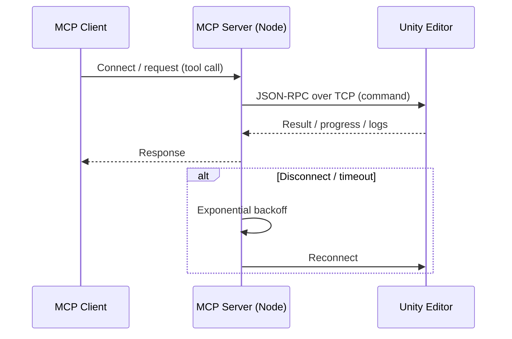
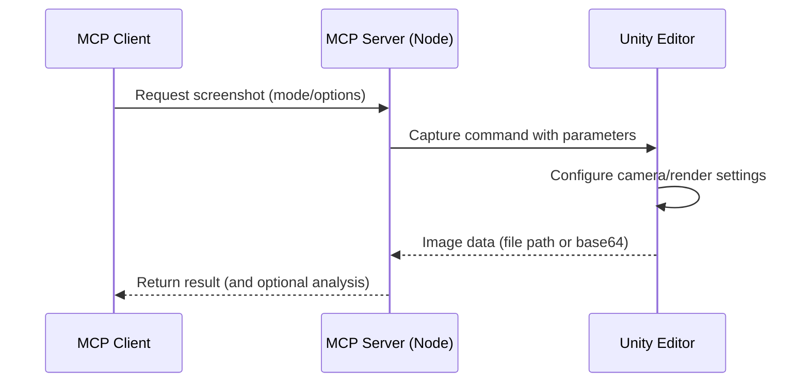
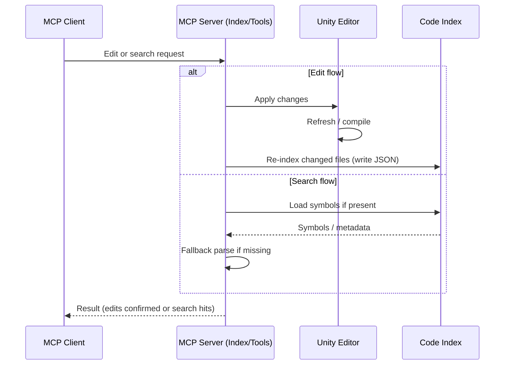

# Unity Editor MCP

English | [日本語](README.ja.md)

## Overview

Unity Editor MCP lets LLM-based clients automate the Unity Editor. It focuses on reliable, scriptable workflows with a simple interface and zero- or low-configuration setup.

### C# Editing Policy (Important)

- All C# symbol/search/structured edits are performed via an external CLI (roslyn-cli) bundled in this repo; no Unity communication is involved.
- Existing `script_*` tools now call the CLI under the hood, so edits are robust to Unity compilation/domain reload.
- Risky line-based patch/pattern replace tools were removed.

Initial setup (roslyn-cli build)

Prereq: .NET 8+ SDK

- macOS/Linux: `./scripts/bootstrap-roslyn-cli.sh osx-arm64|osx-x64|linux-x64`
- Windows: `powershell -ExecutionPolicy Bypass -File scripts/bootstrap-roslyn-cli.ps1 -Rid win-x64`

Outputs to `./.tools/roslyn-cli/<rid>/roslyn-cli` (self-contained, no install).

Common usage (MCP tools)

- Symbols: `script_symbol_find { "name": "ClassName", "kind": "class" }`
- References: `script_refs_find { "name": "MethodName" }`
- Replace body (preflight→apply):
  - `script_edit_structured { "operation": "replace_body", "path": "Packages/.../File.cs", "symbolName": "Class/Method", "newText": "{ /* ... */ }", "preview": true }`
  - then set `"preview": false` to apply if errors are empty
- Insert after class:
  - `script_edit_structured { "operation": "insert_after", "path": "...", "symbolName": "ClassName", "kind": "class", "newText": "\nprivate void X(){}\n", "preview": false }`

Run `AssetDatabase.Refresh` in Unity manually only when needed.

## What It Can Do

- Editor automation: create/modify scenes, GameObjects, components, prefabs, materials
- UI automation: locate and interact with UI, validate UI state
- Input simulation: keyboard/mouse/gamepad/touch for playmode testing (Input System only)
- Visual capture: deterministic screenshots from Game/Scene/Explorer/Window views, optional analysis
- Code base awareness: safe structured edits and accurate symbol/search powered by external Roslyn CLI
- Project control: read/update selected project/editor settings; read logs, monitor compilation

## Unity–MCP Connection

- Host/Port: Unity package opens a TCP server on `UNITY_HOST`/`UNITY_PORT` (default `localhost:6400`).
- Flow: Open Unity project → package starts listening → your MCP client launches the Node server → Node connects to Unity.
- Config: See Configuration section (`project.root`, `project.codeIndexRoot`, `UNITY_MCP_CONFIG`).
- Timeouts/Retry: Exponential backoff with `reconnectDelay`/`maxReconnectDelay`/`reconnectBackoffMultiplier`.
- Troubleshooting: Ensure Unity is running, port 6400 is free, and host/port match.

Architecture

```
┌────────────────┐        JSON-RPC (MCP)        ┌──────────────────────┐
│  MCP Client    │ ───────────────────────────▶ │  Node MCP Server     │
│ (Claude/Codex/ │ ◀─────────────────────────── │ (@akiojin/unity-     │
│   Cursor …)    │        tool responses        │ editor-mcp)          │
└────────────────┘                              └──────────┬───────────┘
                                                         TCP│6400
                                                            ▼
                                                   ┌───────────────────┐
                                                   │  Unity Editor     │
                                                   │  (Package opens   │
                                                   │   TCP listener)   │
                                                   └───────────────────┘
```

Sequence



## Directory Structure

- `UnityEditorMCP/`: Unity project (Editor bridge, tools, samples)
- `mcp-server/`: Node.js MCP server that exposes Unity tools
- `scripts/`: Helper scripts for local development

## Setup

- Unity 2020.3 LTS or newer
- Node.js 18+ and npm
- Claude Desktop or another MCP-compatible client

Installation
- In Unity: Package Manager → Add from git URL → `https://github.com/akiojin/unity-editor-mcp.git?path=UnityEditorMCP/Packages/unity-editor-mcp`
- Configure MCP client (Claude Desktop example):
  - macOS: `~/Library/Application Support/Claude/claude_desktop_config.json`
  - Windows: `%APPDATA%\\Claude\\claude_desktop_config.json`
  - Add:
    ```json
    {
      "mcpServers": {
        "unity-editor-mcp": {
          "command": "npx",
          "args": ["@akiojin/unity-editor-mcp@latest"]
        }
      }
    }
    ```

Usage Flow
- Open Unity project (TCP listener starts on port 6400)
- Start your MCP client and call tools (e.g., ping, scene, script tools)

### Configuration (.unity/config.json)

Configuration is optional; defaults work without any config. When present, the server loads configuration in this order:

- `UNITY_MCP_CONFIG` (absolute path to a JSON file)
- `./.unity/config.json` (relative to the current working directory)
- `~/.unity/config.json` (user-global)

Notes:
- Paths are used as-is. Relative paths resolve from the server process current working directory (not the config file location).
- `~` and environment variable expansion are not applied to path values.

Common keys:
- `project.root`: Unity project root directory (contains `Assets/`).
- `project.codeIndexRoot`: Code Index output directory (default: `<project.root>/Library/UnityMCP/CodeIndex`).

Examples:

```json
{
  "project": {
    "root": "/absolute/path/to/UnityProject",
    "codeIndexRoot": "/absolute/path/to/UnityProject/Library/UnityMCP/CodeIndex"
  }
}
```

Team-friendly (relative) example — ensure you always start the server from the repository root so `process.cwd()` is stable:

```json
{
  "project": {
    "root": ".",
    "codeIndexRoot": "./Library/UnityMCP/CodeIndex"
  }
}
```

Tip: To avoid CWD dependency, prefer `UNITY_MCP_CONFIG=/absolute/path/to/config.json` when launching the server.

#### Configuration Keys

| Key | Type | Default | Description | Allowed values |
| --- | --- | --- | --- | --- |
| `project.root` | string | auto-detect (Unity connection or nearest directory with `Assets/`) | Unity project root directory. Relative paths resolve from process CWD. | — |
| `project.codeIndexRoot` | string | `<project.root>/Library/UnityMCP/CodeIndex` | Code Index storage root. | — |
| `unity.host` | string | `process.env.UNITY_HOST` or `localhost` | Hostname/IP of Unity Editor TCP server. | — |
| `unity.port` | number | `process.env.UNITY_PORT` or `6400` | Port of Unity Editor TCP server. | — |
| `unity.reconnectDelay` | number (ms) | `1000` | Initial delay before reconnect attempts. | — |
| `unity.maxReconnectDelay` | number (ms) | `30000` | Maximum backoff delay between reconnect attempts. | — |
| `unity.reconnectBackoffMultiplier` | number | `2` | Exponential backoff multiplier for reconnects. | — |
| `unity.commandTimeout` | number (ms) | `30000` | Timeout for individual Unity commands. | — |
| `server.name` | string | `unity-editor-mcp-server` | Server name exposed via MCP. | — |
| `server.version` | string | `0.1.0` | Server version string. | — |
| `server.description` | string | `MCP server for Unity Editor integration` | Human-readable description. | — |
| `logging.level` | string | `process.env.LOG_LEVEL` or `info` | Log verbosity for stderr logging. | `debug` | `info` | `warn` |
| `logging.prefix` | string | `[Unity Editor MCP]` | Log prefix used in stderr. | — |
| `writeQueue.debounceMs` | number (ms) | `process.env.WRITE_DEBOUNCE_MS` or `1200` | Debounce window for batched writes. | — |
| `writeQueue.maxEdits` | number | `process.env.WRITE_MAX_EDITS` or `100` | Max edits coalesced per batch. | — |
| `writeQueue.deferDefault` | boolean | `true` (unless `WRITE_DEFER_DEFAULT` is exactly `false`) | Queue writes by default to coalesce changes. | `true` | `false` |
| `search.defaultDetail` | string | `process.env.SEARCH_DEFAULT_DETAIL` or `compact` | Default return detail for search; `compact` maps to `snippets`. | `compact` | `metadata` | `snippets` | `full` |
| `search.engine` | string | `process.env.SEARCH_ENGINE` or `naive` | Search engine implementation. | `naive` (treesitter planned) |

## Screenshot System

- Capture Game View, Scene View, Explorer（AI-framed）, or a specific Editor window.
- Modes: `game` | `scene` | `explorer` | `window`.
- Options:
  - Resolution: `width`/`height` (or in explorer: `camera.width`/`camera.height`).
  - UI Overlay: `includeUI` for Game View.
  - Explorer framing: `explorerSettings.camera.*` (autoFrame, FOV, near/far clip, position/rotation, padding).
  - Display aids: `explorerSettings.display.*` (highlightTarget, showBounds, showColliders, showGizmos, backgroundColor, layers).
  - Target focus: `explorerSettings.target.*` (gameObject/tag/area/position, includeChildren).
  - Output: `outputPath` to save under `Assets/` or return base64 data.
- Analysis: optional UI detection and content summary.

Sequence



## Input Simulation

- Supported: Unity Input System only (new Input System package).
- Not supported: Legacy Input Manager (Project Settings → Input Manager).
- Capabilities: simulate keyboard, mouse, gamepad, and touch input for playmode testing and UI interaction.
- Tip: Ensure your project uses Input System; otherwise simulated input will not affect gameplay.

## C# Editing Backend (Roslyn CLI)

`roslyn-cli` loads your `.sln/.csproj` via Roslyn/MSBuildWorkspace and exposes:
`find-symbol`, `find-references`, `replace-symbol-body`, `insert-before-symbol`, `insert-after-symbol`, `rename-symbol`.
All `script_*` tools call this CLI under the hood.
- Triggers: Asset refresh, compilation complete, script edits applied.

Architecture

- Separation of concerns:
  - Unity: performs C# analysis using Roslyn (Microsoft.CodeAnalysis). Writes per-file JSON via `JsonIndexStore` and invalidates on asset changes.
  - Node: consumes the JSON index for symbol/search. When missing or Unity is unavailable, falls back to a lightweight Node-side extractor.
- Accuracy:
  - Unity uses Roslyn syntax trees to extract `class/struct/interface/enum/method/property` with container/namespace and spans.
  - Reference lookups prefer Roslyn identifier tokens to avoid false hits in comments/strings, with optional container/namespace filters.
- Invalidations:
  - Unity asset postprocessor clears stale entries on import/delete/move of `.cs` files; re-parsing repopulates JSON.

Sequence



 

## Other Clients

### Codex CLI

Configure MCP servers for Codex by creating a config file:

- macOS/Linux: `~/.codex/servers.json`
- Windows: `%USERPROFILE%\.codex\servers.json`

Example:

```json
{
  "mcpServers": {
    "unity-editor-mcp": {
      "command": "npx",
      "args": ["@akiojin/unity-editor-mcp@latest"]
    }
  }
}
```

## Troubleshooting (Short)

- Unity TCP not listening: reopen project; ensure port 6400 is free.
- Node.js cannot connect: Unity running? firewall? logs in Unity/Node terminals.
- C# types missing: refresh assets and wait until compilation completes.
- Technical notes are summarized in this README.

Note: This README now consolidates connection design, screenshot system, and code index specifications.
